# Module 3: The RTL-to-GDSII Toolchain & Full Adder Case Study


---

## Table of Contents

1. [The Two Design Worlds: Digital vs. Analog](#1-the-two-design-worlds-digital-vs-analog)
2. [The Open-Source Digital EDA Toolchain](#2-the-open-source-digital-eda-toolchain)
3. [The Analog/Custom EDA Toolchain](#3-the-analogcustom-eda-toolchain)
4. [Physical Signoff: DRC & LVS](#4-physical-signoff-drc--lvs)
5. [The Complete Open-Source Flow — Mermaid Diagram](#5-the-complete-open-source-flow--mermaid-diagram)
6. [Sub-section 3.1: Case Study — 1-Bit Full Adder Through the Digital Flow](#sub-section-31-case-study--1-bit-full-adder-through-the-digital-flow)
7. [Summary Cheat Sheet](#summary-cheat-sheet)

---

## 1. The Two Design Worlds: Digital vs. Analog

Modern SoC design comprises two fundamentally different domains, each with its own philosophy, toolchain, and success criteria.

| Dimension | Automated Digital Flow | Custom Analog Flow |
|:---|:---|:---|
| **Design Language** | RTL Verilog / SystemVerilog | Schematic (xschem, Virtuoso) + SPICE netlist |
| **Design Abstraction** | Register-Transfer Level — behavior described, layout automated | Transistor level — every device and its W/L ratio hand-crafted |
| **Key Tools (Open-Source)** | `iverilog`, `gtkwave`, `yosys`, `OpenROAD`, `Magic` | `xschem`, `ngspice`, `Magic` (for custom layout), `netgen` (LVS) |
| **Key Tools (Industry)** | VCS/Questa, DC/Genus, Innovus/ICC2, Calibre | Virtuoso (Cadence), HSPICE/Spectre, Calibre, Assura |
| **Layout Generation** | Automated — Place & Route engine generates GDSII from netlist | Manual — designer draws every transistor, wire, and device geometry |
| **Primary Metric** | Timing closure (setup/hold margins), PPA from synthesis | DC operating point, AC frequency response, SNR, THD, noise margins |
| **Verification Method** | RTL simulation + Formal + STA + Gate-level sim | SPICE transient/AC/DC analysis, Monte Carlo, corner analysis |
| **Output** | GDSII (from P&R) | GDSII (from manual layout + DRC/LVS verified) |
| **Typical Blocks** | CPUs, DSP, fabric, controllers, state machines | PLL, ADC/DAC, LDO, bandgap reference, SerDes PHY, SRAM bit cell |

---

## 2. The Open-Source Digital EDA Toolchain

The complete open-source digital flow maps to the following tools, each handling a specific stage of design intent's transformation into silicon geometry.

### 2.1 Tool Roles and Responsibilities

#### 🔬 Icarus Verilog (`iverilog`) — RTL Compilation & Simulation

`iverilog` is an open-source Verilog compiler and simulator implementing IEEE 1364-2005. It:
- Parses and elaborates your RTL Verilog files
- Compiles to an intermediate bytecode (.vvp)
- Executes the simulation, reading testbench stimulus and producing VCD waveform files

```bash
# Compile RTL + testbench
iverilog -o fulladder_sim.vvp -g2012 fulladder.v fulladder_tb.v

# Execute simulation (produces waveform dump)
vvp fulladder_sim.vvp

# Output: fulladder_dump.vcd  (Value Change Dump — waveform data)
```

#### 📊 GTKWave (`gtkwave`) — Waveform Visualization

`gtkwave` opens the `.vcd` (Value Change Dump) file produced by `iverilog`/`vvp` and displays signal waveforms. The designer inspects whether the DUT's outputs match the expected specification before proceeding to synthesis.

```bash
gtkwave fulladder_dump.vcd
# Opens GUI: drag signals from signal tree to waveform viewer
```

#### ⚙️ Yosys (`yosys`) — RTL Synthesis

`yosys` is a synthesizer and synthesis framework. It:
1. Parses RTL Verilog into an internal representation (RTLIL)
2. Applies optimization passes (constant propagation, dead code elimination, resource sharing)
3. Maps the optimized logic to gates using a technology library (e.g., `synth_ice40`, `synth -lib sky130_fd_sc_hd.lib`)
4. Outputs a gate-level netlist in Verilog

```bash
# Run Yosys for SkyWater 130nm synthesis
yosys -p "
  read_verilog fulladder.v;
  synth -top fulladder;
  dfflibmap -liberty sky130_fd_sc_hd__tt_025C_1v80.lib;
  abc -liberty sky130_fd_sc_hd__tt_025C_1v80.lib;
  write_verilog -noattr fulladder_netlist.v
"
```

#### 📐 OpenROAD — Place & Route (P&R)

`OpenROAD` is the complete open-source physical design implementation suite. It performs:
- **Floorplanning** (`initialize_floorplan`) — die size, I/O ring, macro placement
- **Power Planning** (`pdngen`) — VDD/VSS power ring and straps
- **Placement** (`place_design`) — standard cell placement optimized for timing/density
- **Clock Tree Synthesis** (`clock_tree_synthesis`) — balances clock skew across flip-flops
- **Routing** (`route_design`) — detailed routing of all signal nets on metal layers
- **Timing Analysis** (`report_checks`) — integrated STA at each stage

```tcl
# OpenROAD TCL script (conceptual)
read_lef sky130_fd_sc_hd.tlef
read_lef sky130_fd_sc_hd.lef
read_liberty sky130_fd_sc_hd__tt_025C_1v80.lib
read_verilog fulladder_netlist.v
link_design fulladder

initialize_floorplan -utilization 50 -aspect_ratio 1.0 \
                     -core_space 10 -site unithd

pdngen pdn_config.tcl

place_design
clock_tree_synthesis -buf_list "sky130_fd_sc_hd__buf_1"
route_design

write_def fulladder_routed.def
write_gds fulladder.gds   # Final GDSII output
```

#### 🎨 Magic — Layout Viewer, DRC & GDSII Editor

`Magic` is the open-source VLSI layout editor. Used for:
- Viewing the GDSII output from OpenROAD
- Running DRC (Design Rule Check) against the SkyWater 130nm rules
- Manual layout for custom analog cells
- Generating the final merged GDSII for tape-out

#### 🔌 xschem — Schematic Capture (Analog)

`xschem` is an open-source schematic editor for analog design. Designers draw transistor-level circuits (op-amps, bandgaps, PLLs) using PDK-provided device symbols, then export to a SPICE netlist for simulation.

#### 📊 ngspice — SPICE Circuit Simulator (Analog)

`ngspice` is an open-source SPICE simulator. It takes the netlist exported from xschem and runs transistor-level transient, AC, or DC analysis — the cornerstone of analog verification.

```spice
* ngspice netlist: CMOS Inverter transient analysis
.include "sky130.lib" tt   ; SkyWater 130nm TT corner models

M1 out in vdd vdd sky130_fd_pr__pfet_01v8 W=1u L=150n
M2 out in gnd gnd sky130_fd_pr__nfet_01v8 W=500n L=150n

Vdd vdd gnd DC 1.8V
Vin in  gnd PULSE(0 1.8 0 100p 100p 5n 10n)

.tran 10p 50n    ; Transient: 10ps step, 50ns total
.measure tran tpHL TRIG v(in) VAL=0.9 RISE=1 TARG v(out) VAL=0.9 FALL=1
.measure tran tpLH TRIG v(in) VAL=0.9 FALL=1 TARG v(out) VAL=0.9 RISE=1

.control
  run
  plot v(in) v(out)
.endc
.end
```

---

## 3. The Analog/Custom EDA Toolchain

The analog flow has no automated synthesis step — every transistor is placed by hand.

```
xschem (Schematic)
    ↓ export SPICE netlist
ngspice (Simulation: DC, AC, Transient, Monte Carlo)
    ↓ verified behavior
Magic / Virtuoso (Manual Layout: draw every device, wire, via)
    ↓
DRC → Layout is geometrically correct per foundry rules
    ↓
LVS (netgen / Calibre) → Extracted layout netlist matches schematic netlist
    ↓
GDSII → Sent to foundry
```

> **🔥 Interview Trap**
>
> **Q: Can you synthesize an analog PLL or an ADC from an RTL description?**
>
> **No** — at least not in the traditional sense. Analog circuits depend on precise **transistor operating points, device matching, noise behavior, and parasitics** that no synthesis tool can reliably model or optimize.  
>
> High-level synthesis (HLS) tools like Cadence Stratus can transform C/SystemC descriptions of *digital* signal processing algorithms into RTL. Some emerging tools attempt "analog synthesis" for simple blocks (like data converters), but for foundry tape-out of production PLLs, SerDes, or LDOs — **a human expert draws the layout, transistor by transistor, in Virtuoso or Magic.** This is why analog designers are among the highest-paid engineers in the semiconductor industry.

---

## 4. Physical Signoff: DRC & LVS

Before a GDSII file is sent to the foundry for fabrication, it must pass two critical physical verification steps. These checks are binary — the chip either passes both completely, or it is not fabbed.

### 4.1 DRC — Design Rule Check

**What it checks:** That all geometric shapes in the GDSII layout comply with the foundry's physical manufacturing rules.

Each process node has thousands of rules specifying minimum widths, spacings, enclosures, and overlaps for each layer. Violating a rule means the foundry's photolithography cannot reliably reproduce the pattern — leading to shorts, opens, or yield loss.

**Examples of SkyWater 130nm DRC rules:**
```
Rule nwell.1:   Minimum width of n-well = 0.84 µm
Rule poly.1:    Minimum width of polysilicon = 0.15 µm
Rule poly.2:    Minimum polysilicon spacing = 0.21 µm
Rule li1.1:     Minimum width of local interconnect = 0.17 µm
Rule mcon.1:    Minimum contact (metal-to-li) enclosure by li = 0.06 µm
Rule m1.1:      Minimum width of Metal 1 = 0.14 µm
Rule m1.2:      Minimum spacing of Metal 1 = 0.14 µm
```

**Tool:** `Magic` (open-source), `Calibre DRC` (industry), `Mentor Pegasus` (industry).

### 4.2 LVS — Layout Versus Schematic

**What it checks:** That the electrical netlist extracted from the physical GDSII layout **exactly matches** the original schematic/RTL netlist.

The LVS tool:
1. Extracts a netlist from the GDSII layout by analyzing device geometries (identifying MOSFET W/L from diffusion layers) and connectivity (tracing metal layers and vias)
2. Compares the extracted netlist against the reference (schematic or synthesized netlist)
3. Reports any mismatches: missing devices, wrong connections, swapped pins, floating nets

**Why LVS matters:** During physical design, routing errors, manual edits, or incorrect cell placements can introduce connections that do not exist in the verified schematic. A chip that passes DRC but fails LVS will be fabricated — but it will not function correctly.

**Tool:** `netgen` (open-source, pairs with Magic), `Calibre LVS` (industry), `Mentor Calibre` (industry).

```bash
# Running LVS with netgen (open-source)
# Compare Magic-extracted netlist vs. Yosys-synthesized netlist
netgen -batch lvs "fulladder_layout.spice fulladder" \
                  "fulladder_netlist.v fulladder" \
                  sky130A_setup.tcl
# Output: "Circuits match uniquely." = PASS ✅
# Output: "Netlists do not match." = Routing/layout bugs found ❌
```

> **🔥 Interview Trap**
>
> **Q: A chip passes DRC. Does that guarantee it will work correctly?**
>
> **Absolutely not.** DRC only guarantees geometric correctness — that the layout can be physically manufactured per the foundry's rules.  
> A layout could pass DRC but:
> - Have a wrong connection (metal route touching wrong net) → **LVS catch**
> - Have a setup time violation (flip-flop not sampling data correctly) → **STA catch**
> - Have electromigration issues (wire too narrow for its current) → **IR drop / EM analysis catch**
> - Have ESD (electrostatic discharge) vulnerability (missing protection diodes) → **ESD design review catch**
>
> **Signoff requires: DRC ✅ + LVS ✅ + STA ✅ + Power Integrity ✅ + ESD ✅** — all must pass before the GDSII is released to the foundry.

---

## 5. The Complete Open-Source Flow — Mermaid Diagram

```mermaid
flowchart TD
    subgraph RTL["📝 RTL Design"]
        A["Write RTL\nfulladder.v\n(Verilog)"]
        B["Write Testbench\nfulladder_tb.v"]
    end

    subgraph VERIFY["🧪 Verification\n(iverilog + gtkwave)"]
        C["iverilog -o sim.vvp\nfulladder.v fulladder_tb.v"]
        D["vvp sim.vvp\n→ generates dump.vcd"]
        E["gtkwave dump.vcd\nInspect waveforms"]
        F{Functional\nCorrect?}
    end

    subgraph SYNTH["⚙️ Synthesis\n(yosys + SkyWater 130nm PDK)"]
        G["yosys:\nread_verilog → synth → abc\n→ write_verilog"]
        H["Gate-level Netlist\nfulladder_netlist.v\n(sky130 standard cells)"]
    end

    subgraph PNR["📐 Place & Route\n(OpenROAD)"]
        I["Floorplan\ninitialize_floorplan\nDie size, core area, I/O"]
        J["Power Planning\npdngen\nVDD/VSS rings & straps"]
        K["Placement\nplace_design\nStandard cells positioned"]
        L["Clock Tree Synthesis\nCTS — balance clock skew"]
        M["Routing\nroute_design\nAll signal nets connected"]
        N["STA Check\nreport_checks\nSetup/Hold margins"]
    end

    subgraph SIGNOFF["✅ Signoff\n(Magic + netgen)"]
        O["DRC\nMagic DRC\nGeometric rule check"]
        P["LVS\nnetgen\nLayout vs. netlist match"]
        Q{DRC &\nLVS Pass?}
        R["✅ Final GDSII\nfulladder.gds\nSent to Foundry"]
    end

    A --> C
    B --> C
    C --> D --> E --> F
    F -- "Fail ❌" --> A
    F -- "Pass ✅" --> G
    G --> H --> I --> J --> K --> L --> M --> N
    N --> O --> P --> Q
    Q -- "Fail ❌" --> K
    Q -- "Pass ✅" --> R

    style RTL fill:#0d2e1a,stroke:#4caf50,color:#c8e6c9
    style VERIFY fill:#0d1a2e,stroke:#2196f3,color:#bbdefb
    style SYNTH fill:#2e1a0d,stroke:#ff9800,color:#ffe0b2
    style PNR fill:#1a0d2e,stroke:#9c27b0,color:#e1bee7
    style SIGNOFF fill:#2e0d0d,stroke:#f44336,color:#ffcdd2
    style R fill:#0d2e0d,stroke:#00c853,color:#b9f6ca
```



---

## Sub-section 3.1: Case Study — 1-Bit Full Adder Through the Digital Flow

A 1-bit Full Adder is the quintessential building block of every arithmetic unit in every processor. It computes the sum and carry of three 1-bit inputs: A, B, and Cin (carry in).

**Truth Table:**
```
A  B  Cin | Sum  Cout
0  0   0  |  0    0
0  0   1  |  1    0
0  1   0  |  1    0
0  1   1  |  0    1
1  0   0  |  1    0
1  0   1  |  0    1
1  1   0  |  0    1
1  1   1  |  1    1

Boolean Equations:
  Sum  = A ⊕ B ⊕ Cin
  Cout = (A·B) + (B·Cin) + (A·Cin)
```

---

### Stage 1: Behavioral RTL — `fulladder.v`

```verilog
// ============================================================
// 1-BIT FULL ADDER — Behavioral Verilog
// File: fulladder.v
//
// This is the RTL source that enters the yosys synthesis flow.
// Written at the dataflow level for clarity and synthesis
// compatibility. No synthesizer-unfriendly constructs.
// ============================================================
module fulladder (
    input  wire a,    // Input operand A
    input  wire b,    // Input operand B
    input  wire cin,  // Carry input from previous stage
    output wire sum,  // Sum output: A XOR B XOR Cin
    output wire cout  // Carry output: majority function
);
    // Dataflow-level continuous assignments
    // Synthesizer will map these XOR/AND/OR operations
    // to the closest matching standard cells in the PDK library.
    assign sum  = a ^ b ^ cin;
    assign cout = (a & b) | (b & cin) | (a & cin);

module fulladder (
    input  wire a,    // Input operand A
    input  wire b,    // Input operand B
    input  wire cin,  // Carry input from previous stage
    output wire sum,  // Sum output: A XOR B XOR Cin
    output wire cout  // Carry output: majority function
);
    // Dataflow-level continuous assignments
    // Synthesizer will map these XOR/AND/OR operations
    // to the closest matching standard cells in the PDK library.
    assign sum  = a ^ b ^ cin;
    assign cout = (a & b) | (b & cin) | (a & cin);

endmodule
```

---

### Stage 2: Testbench — `fulladder_tb.v`

```verilog
// ============================================================
// FULL ADDER TESTBENCH
// File: fulladder_tb.v
//
// Exhaustive test: all 8 input combinations.
// Uses $dumpfile/$dumpvars for GTKWave waveform capture.
// ============================================================
`timescale 1ns / 1ps

module fulladder_tb;
    // DUT stimulus registers
    reg  a_tb, b_tb, cin_tb;
    // DUT output wires
    wire sum_tb, cout_tb;

    // Instantiate the Design Under Test (DUT)
    fulladder DUT (
        .a   (a_tb),
        .b   (b_tb),
        .cin (cin_tb),
        .sum (sum_tb),
        .cout(cout_tb)
    );

    // Waveform dump for GTKWave
    initial begin
        $dumpfile("fulladder_dump.vcd");
        $dumpvars(0, fulladder_tb);
    end

    // Stimulus: exhaustive 3-bit sweep
    initial begin
        $display("==============================================");
        $display(" A  B  Cin | Sum Cout | Expected");
        $display("==============================================");

        {a_tb, b_tb, cin_tb} = 3'b000; #10;  // Expected: Sum=0, Cout=0
        $display(" %b  %b   %b  |  %b    %b  | Sum=0 Cout=0", a_tb,b_tb,cin_tb,sum_tb,cout_tb);

        {a_tb, b_tb, cin_tb} = 3'b001; #10;  // Expected: Sum=1, Cout=0
        $display(" %b  %b   %b  |  %b    %b  | Sum=1 Cout=0", a_tb,b_tb,cin_tb,sum_tb,cout_tb);

        {a_tb, b_tb, cin_tb} = 3'b010; #10;
        $display(" %b  %b   %b  |  %b    %b  | Sum=1 Cout=0", a_tb,b_tb,cin_tb,sum_tb,cout_tb);

        {a_tb, b_tb, cin_tb} = 3'b011; #10;  // Expected: Sum=0, Cout=1
        $display(" %b  %b   %b  |  %b    %b  | Sum=0 Cout=1", a_tb,b_tb,cin_tb,sum_tb,cout_tb);

        {a_tb, b_tb, cin_tb} = 3'b100; #10;
        $display(" %b  %b   %b  |  %b    %b  | Sum=1 Cout=0", a_tb,b_tb,cin_tb,sum_tb,cout_tb);

        {a_tb, b_tb, cin_tb} = 3'b101; #10;  // Expected: Sum=0, Cout=1
        $display(" %b  %b   %b  |  %b    %b  | Sum=0 Cout=1", a_tb,b_tb,cin_tb,sum_tb,cout_tb);

        {a_tb, b_tb, cin_tb} = 3'b110; #10;
        $display(" %b  %b   %b  |  %b    %b  | Sum=0 Cout=1", a_tb,b_tb,cin_tb,sum_tb,cout_tb);

        {a_tb, b_tb, cin_tb} = 3'b111; #10;  // Expected: Sum=1, Cout=1
        $display(" %b  %b   %b  |  %b    %b  | Sum=1 Cout=1", a_tb,b_tb,cin_tb,sum_tb,cout_tb);

        $display("==============================================");
        $display(" Simulation complete. Check waveforms.");
        $display("==============================================");
        $finish;
    end
endmodule
```

---

### Stage 3: Synthesis with Yosys → SkyWater 130nm Netlist

When `yosys` synthesizes the full adder against the SkyWater 130nm High-Density (HD) standard cell library, it executes a multi-pass transformation:

**Yosys Internal Flow:**
1. **`read_verilog`** — Parse RTL into RTLIL (RTL Intermediate Language)
2. **`synth`** — Technology-independent optimization (constant propagation, CSE, boolean simplification)
3. **`dfflibmap`** — Map flip-flops to library flip-flop cells (not needed for pure combinational logic like this adder)
4. **`abc -liberty`** — Map logic using the Berkeley ABC tool: reads `.lib` characterization data, finds optimal cell mapping for area/timing
5. **`write_verilog`** — Output gate-level netlist referencing sky130 cell names

**Conceptual Synthesized Netlist (after Yosys + ABC mapping to SkyWater SKY130):**

```verilog
// ============================================================
// GATE-LEVEL NETLIST — Output of Yosys + ABC
// Technology: SkyWater 130nm (sky130_fd_sc_hd)
//
// The synthesizer chose:
//   - sky130_fd_sc_hd__xor2_1  : 2-input XOR for partial sum
//   - sky130_fd_sc_hd__xor3_1  : 3-input XOR for final sum
//     (or may use two XOR2 gates instead — ABC decides)
//   - sky130_fd_sc_hd__maj3_1  : 3-input Majority for carry
//     (implements: (A·B)+(B·C)+(A·C) directly)
//
// Note: actual cell names and count depend on timing/area
// optimization mode. This is a representative, conceptual
// equivalent of what Yosys generates.
// ============================================================
module fulladder (a, b, cin, sum, cout);
    input  a, b, cin;
    output sum, cout;

    wire _0_; // Internal net: intermediate XOR result

    // Stage 1: Compute partial sum A XOR B
    // sky130_fd_sc_hd__xor2_1: 1-drive-strength XOR2 cell
    sky130_fd_sc_hd__xor2_1 _cell_xor_ab_ (
        .A(_0_),    // Output: A XOR B → internal wire
        .X(a),      // Input A (pin naming per liberty file)
        .B(b)       // Input B
    );

    // Stage 2: Compute final Sum = (A XOR B) XOR Cin
    sky130_fd_sc_hd__xor2_1 _cell_xor_sum_ (
        .A(sum),    // Output: Final sum
        .X(_0_),    // A XOR B (from stage 1)
        .B(cin)     // Carry In
    );

    // Stage 3: Compute Carry Out using Majority-3 function
    // MAJ3 implements exactly: Cout = (A·B) + (B·C) + (A·C)
    // This is a single standard cell — more efficient than 3 AND2 + OR
    sky130_fd_sc_hd__maj3_1 _cell_maj_cout_ (
        .A(a),      // Input A
        .B(b),      // Input B
        .C(cin),    // Input Cin
        .X(cout)    // Output: Carry out
    );

    // Power and Ground connections (required by sky130 cells)
    // Automatically connected during P&R PDN generation
    // sky130_fd_sc_hd__xor2_1 and __maj3_1 each have
    // VPWR, VGND, VPB, VNB pins connected to power rails

endmodule
```

**Key insight:** The `abc` tool within Yosys examined the SkyWater 130nm `.lib` file, which specifies the area, timing (rise/fall delays), power, and function of every available standard cell. It determined that `sky130_fd_sc_hd__maj3_1` directly implements the majority-3 function (the carry equation) as a single cell, which is more area and power efficient than building it from AND2 + OR combinator primitives.

---

### Stage 4: Physical Implementation — Floorplan → Placement → Routing → GDSII

After synthesis produces the gate-level netlist, OpenROAD transforms it into physical GDSII through four major sub-stages:

```mermaid
flowchart TD
    NET["📋 Gate-level Netlist\nfulladder_netlist.v\n3 sky130 standard cells:\n1× XOR2, 1× XOR2, 1× MAJ3"]

    subgraph FP["Step 1: Floorplan"]
        FP1["Define Die & Core Area\nDie: ~25µm × 25µm\nCore utilization: 50%\nI/O pin placement: a, b, cin → sum, cout"]
    end

    subgraph PP["Step 2: Power Planning"]
        PP1["VDD Ring: Metal 1/2 around die perimeter\nVSS Ring: Alongside VDD\nMetal straps: every 10µm for IR drop reduction\nDecap cells: fill unused space to stabilize VDD"]
    end

    subgraph PL["Step 3: Placement"]
        PL1["Place 3 standard cells within core area\nXOR2 → ~5.5µm × 2.7µm footprint\nMAJ3 → ~7.4µm × 2.7µm footprint\nTiming-driven: short cone paths\nDensity: ~50% core utilization"]
    end

    subgraph RT["Step 4: Routing"]
        RT1["Global Routing: Assign nets to routing regions\nDetailed Routing: Exact wire paths on metal layers\n• Metal 1 (M1): local connections, power rails\n• Metal 2 (M2): horizontal signal routing\n• Metal 3 (M3): vertical routing if needed\nVias: M1↔M2 connections"]
    end

    subgraph STA["Step 5: Static Timing Analysis"]
        STA1["report_checks -path_delay max\nCritical path: a→XOR2→XOR2→sum\nEstimated prop delay: ~0.5ns\nAt 1.8V, 25°C (TT corner)\nSetup slack: positive ✅ (combinational block,\nno clock — hold not applicable)"]
    end

    subgraph GDS["Step 6: GDSII Output"]
        GDS1["write_gds fulladder.gds\nAll geometric layers:\nNWELL, DIFF, POLY, LI, M1, M2\nVIAxxx, METxxx\nReady for DRC → LVS → Foundry tape-out"]
    end

    NET --> FP1 --> PP1 --> PL1 --> RT1 --> STA1 --> GDS1

    style NET fill:#0d1a2e,stroke:#2196f3,color:#bbdefb
    style FP fill:#1a0d2e,stroke:#9c27b0,color:#e1bee7
    style PP fill:#2e1a0d,stroke:#ff9800,color:#ffe0b2
    style PL fill:#0d2e1a,stroke:#4caf50,color:#c8e6c9
    style RT fill:#1a1a2e,stroke:#3f51b5,color:#c5cae9
    style STA fill:#2e0d1a,stroke:#e91e63,color:#fce4ec
    style GDS fill:#0d2e0d,stroke:#00c853,color:#b9f6ca
```



### Stage 4 — Physical Details Explained

#### Floorplan
For a simple 3-cell design, the floorplan is trivial — the key decisions are:
- **Die area:** Conservative ~25µm × 25µm (much larger than needed, but minimum practical for test fabrication)
- **I/O pins:** `a`, `b`, `cin` placed on the left edge; `sum`, `cout` on the right edge to minimize signal routing distance
- **Utilization:** ~50% — leave room for routing channels because combinational cells have many interconnections

#### Placement
The placement engine positions the 3 cells. For a Full Adder:
- The two XOR2 gates form the **critical path** (longest propagation delay): input → XOR2 → XOR2 → sum output. The placer puts these physically adjacent to minimize wire length and RC delay on this path.
- The MAJ3 gate computes `cout` independently after receiving `a`, `b`, `cin` — it is placed near the `cout` output pin.

**SkyWater 130nm cell dimensions for reference:**
```
sky130_fd_sc_hd__xor2_1 : Width = 5.52µm, Height = 2.72µm
sky130_fd_sc_hd__maj3_1 : Width = 7.36µm, Height = 2.72µm
```
All standard cells have the same **height** (2.72µm for the HD library) — this is the defining feature of a standard cell library. They snap to **rows** in the placement grid.

#### Routing
The router connects cell pins using metal layers:
- **Local Interconnect (LI1):** Connects within a cell and to M1 contacts
- **Metal 1 (M1):** Horizontal routing, power rails
- **Metal 2 (M2):** Vertical routing for signal interconnections
- **Via1:** M1-to-M2 connections

For a 3-cell design, all routing on only M1 and M2 is typically achievable with zero congestion.

#### STA (Static Timing Analysis) Result
The full adder is purely combinational — no clock. The critical path analysis gives:

```
Critical Path:  Input a → XOR2 (Stage 1) → XOR2 (Stage 2) → Output sum
  sky130_fd_sc_hd__xor2_1 propagation delay (TT, 1.8V, 25°C): ~0.28ns
  Wire RC delay (M1, ~3µm): ~0.02ns
  Second XOR2 delay: ~0.28ns
  ───────────────────────────────────
  Total critical path delay: ~0.58ns
  Max frequency (if registered): ~1.7 GHz

Cout path: a,b,cin → MAJ3 → cout
  sky130_fd_sc_hd__maj3_1 delay (TT, 1.8V, 25°C): ~0.35ns
```

---

## Summary Cheat Sheet

| Tool | Stage | Role | Open-Source? |
|:---|:---|:---|:---|
| **iverilog** | RTL Simulation | Compile & execute Verilog simulation | ✅ Yes |
| **gtkwave** | RTL Simulation | View VCD waveforms | ✅ Yes |
| **yosys** | Synthesis | RTL → Gate-level netlist (ABC maps to PDK lib) | ✅ Yes |
| **OpenROAD** | Place & Route | Floorplan → Power → Placement → CTS → Routing → GDSII | ✅ Yes |
| **Magic** | Layout / DRC | View GDSII, run DRC, manual layout | ✅ Yes |
| **netgen** | LVS | Compare layout netlist vs. schematic netlist | ✅ Yes |
| **xschem** | Analog Schematic | Transistor-level schematic for analog blocks | ✅ Yes |
| **ngspice** | Analog Simulation | SPICE transient/AC/DC analysis | ✅ Yes |

| Step | What it Produces | Key Decision |
|:---|:---|:---|
| **RTL Coding** | `fulladder.v` — behavioral intent | Choose correct abstraction level; avoid non-synthesizable constructs |
| **Simulation** | `dump.vcd` — functional waveforms | Does behavior match truth table? Fix bugs before synthesis |
| **Synthesis (Yosys)** | `fulladder_netlist.v` — sky130 standard cells | Timing constraints, optimization target (area vs. speed) |
| **Floorplan** | Die boundary, I/O positions | Utilization target, aspect ratio, macro placement |
| **Power Planning** | VDD/VSS grid | IR drop budget, current density (EM rules) |
| **Placement** | Positioned standard cells | Timing-driven placement for critical path |
| **Routing** | Wired metal connections | Congestion avoidance, layer assignment |
| **DRC** | Pass/Fail per foundry geometric rules | Must pass 100% before tape-out |
| **LVS** | Layout netlist == schematic netlist | Must match uniquely before tape-out |
| **GDSII** | `fulladder.gds` — fab-ready geometry | → Sent to SkyWater foundry |

> **🔥 Interview Trap**
>
> **Q: Does a positive timing slack at the synthesis stage guarantee timing closure after P&R?**
>
> **No — and this is a critical point.** Synthesis operates on **estimated wire loads** (statistical models of wire length and RC based on design size and technology rules). The P&R tool uses **actual wire lengths and parasitics** extracted from the real routed layout (often using RC extraction from the `parasitic` or `.spef` file).  
>
> A design that closes timing in synthesis with 200ps of slack may have **violations after routing** because:
> - Long global wires between distant cells add unexpected RC delay
> - Vias add resistance
> - Clock tree insertion creates insertion delay
>
> **The rule:** Final timing sign-off is always done **post-route**, with parasitic extraction from the actual GDSII geometry. Synthesis timing is a guide, not a guarantee.

