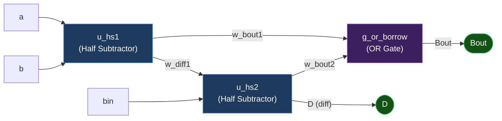
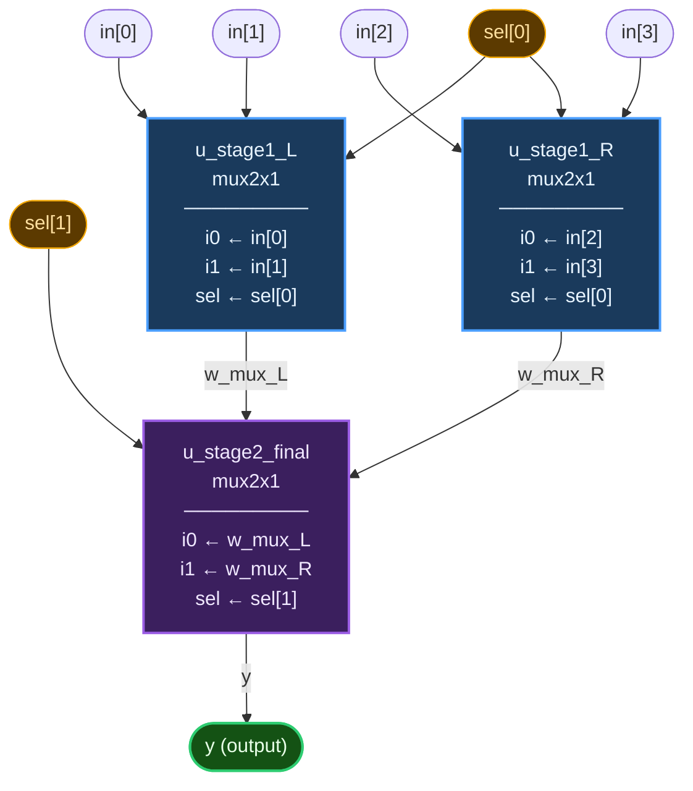

# Structural Modeling in Verilog: The Silicon Schematic


---

## Table of Contents

1. [Preamble: What is Structural Modeling?](#1-preamble-what-is-structural-modeling)
2. [Instantiation: Positional vs. Named Port Mapping](#2-instantiation-positional-vs-named-port-mapping)
3. [Structural Design Best Practices](#3-structural-design-best-practices)
4. [Built-in Gate Primitives](#4-built-in-gate-primitives)
5. [Real-World Structural Designs](#5-real-world-structural-designs)
   - [Example A: Full Subtractor (Hierarchical Design)](#example-a-the-full-subtractor-hierarchical-design)
   - [Example B: 4:1 MUX Tree](#example-b-the-41-mux-tree)
6. [Structural vs. Behavioral: The Design Paradigm Spectrum](#6-structural-vs-behavioral-the-design-paradigm-spectrum)
7. [Senior Engineer PYQ & Debugging Masterclass](#7-senior-engineer-pyq--debugging-masterclass)

---

## 1. Preamble: What is Structural Modeling?

In **Behavioral** or **Dataflow** modeling, you tell the synthesizer *what math to do* (e.g., `assign y = a + b`), and the tool figures out which gates to use. You are writing a *specification*.

In **Structural Modeling**, you strip away all abstraction. You act as a **silicon electrician**. You manually instantiate physical components — gates, lower-level modules, IP blocks — and solder them together using `wire`. You are writing a *schematic in text form*.

| Property | Behavioral / Dataflow | Structural |
|---|---|---|
| **Abstraction level** | High — logic inferred by tool | Low — you place every component |
| **Logic inference** | Yes — `+`, `-`, `if/else` | **None** — no operators, no `assign` |
| **Equivalent to** | Writing an algorithm | Drawing a schematic |
| **Primary use** | RTL design | Netlists, gate-level simulation, SoC integration |
| **Hardware proximity** | Indirect | **Direct — 1:1 with silicon** |

### Why it matters

```
┌──────────────────────────────────────────────────────────┐
│  Behavioral RTL  →  Synthesis Tool  →  Gate-Level Netlist │
│       (you)             (magic)        (structural Verilog)│
└──────────────────────────────────────────────────────────┘
```

The **output** of a synthesis tool *is* structural Verilog. Understanding structural modeling means you can read and debug the exact netlist your chip will be manufactured from. This is non-negotiable for any SoC/ASIC role.

**Three core pillars of structural modeling:**

1. **No logic inference** — You cannot use `+`, `-`, `*`, or `assign` for logic. Every logical function must come from an instantiated module or gate primitive.
2. **Pure Hierarchy** — This is how complex SoCs are built: by instantiating ALUs, registers, FIFOs, and memory blocks into a top-level wrapper.
3. **Netlist Mapping** — Structural code looks almost exactly like the post-synthesis gate-level netlist — the final artifact delivered to the foundry.

---

## 2. Instantiation: Positional vs. Named Port Mapping

When you plug a lower-level chip (sub-module) into your top-level "motherboard," you must connect its ports to your local wires. There are two syntactically valid ways. **One is a fireable offense in industry; the other is mandatory.**

### ❌ Positional Mapping — The Amateur Trap

Ports are mapped based purely on the **order** they appear in the sub-module's definition.

```verilog
// Sub-module definition:
// module mux2x1 (input i0, input i1, input sel, output y);

// Instantiation using POSITIONAL (order-dependent) mapping:
mux2x1 u_mux (a, b, s, out);
//             ^  ^  ^  ^^^
//             i0 i1 sel y  ← matched by ORDER, not by name
```

**Why it fails code reviews:**  
If another engineer updates `mux2x1` and reorders ports to `(sel, i0, i1, y)`, your instantiation silently wires the select line to data pin `i0`. **The compiler will not throw an error.** Your chip passes simulation, fails post-silicon, and you spend six weeks in debug. Positional mapping is banned by every industrial RTL coding guideline (ARM, NVIDIA, Intel internal standards).

---

### ✅ Named Port Mapping — The Industry Standard

Ports are explicitly mapped using the `.sub_port(top_wire)` syntax. The order you write them does not matter.

```verilog
// CORRECT — Named port mapping (order-independent, self-documenting):
mux2x1 u_mux (
    .i0  (a),     // Connect top-level wire 'a'   → sub-module port 'i0'
    .i1  (b),     // Connect top-level wire 'b'   → sub-module port 'i1'
    .sel (s),     // Connect top-level wire 's'   → sub-module port 'sel'
    .y   (out)    // Connect sub-module port 'y'  → top-level wire 'out'
);
```

**Why it is mandatory:**
- **Port reorder-safe** — The `.port(wire)` binding is explicit; moving ports in the sub-module definition has zero effect here.
- **Compiler-checked** — If a port is added or removed from the sub-module, the compiler throws an immediate structural error, not a silent functional mismatch.
- **Self-documenting** — A reader can understand the connection without looking up the sub-module.

---

## 3. Structural Design Best Practices

These rules are enforced by industrial coding standards (e.g., Synopsys RTL Coding Guidelines, Arm IHI0049).

### Rule 1: Explicitly Declare All Internal Wires

```verilog
// ❌ WRONG — relying on Verilog's "implicit wire" feature:
// If 'w_carry' is used but never declared, Verilog assumes wire [0:0] w_carry.
// This is a 1-bit wire by default — silent width truncation for wider signals!

// ✅ CORRECT — always declare wires before use:
wire [7:0] w_sum;      // Named with w_ prefix: routing wire
wire       w_carry;    // Clear declaration prevents implicit-wire bugs
```

> **The implicit wire danger:** `wire` is Verilog's default net type. An undeclared signal connected to a port creates an **implicit 1-bit wire**, silently truncating any multi-bit connection. Most synthesis tools will warn; some will not.

---

### Rule 2: The `u_` Prefix for Instance Names

```verilog
// ❌ Ambiguous — is 'full_adder' a module type or an instance?
full_adder fa1 (.a(x), .b(y), .sum(s));

// ✅ Clear — u_ prefix marks this as a physical unit (instantiated block)
full_adder u_fa1 (
    .a   (x),
    .b   (y),
    .sum (w_sum)
);
```

**Naming conventions in practice:**

| Prefix | Meaning | Example |
|---|---|---|
| `u_` | Module instance (unit) | `u_adder`, `u_fifo`, `u_alu` |
| `w_` | Internal routing wire | `w_carry`, `w_data_mux` |
| `g_` | Gate primitive instance | `g_and_0`, `g_or_borrow` |
| `i_` | Input port | `i_clk`, `i_data` |
| `o_` | Output port | `o_valid`, `o_result` |

---

### Rule 3: One Port Per Line

```verilog
// ❌ Unreadable — impossible to diff or comment individual connections:
d_ff u_ff (.d(data_in), .clk(clk), .rst_n(rst_n), .q(data_out));

// ✅ Git-diffable, commentable, review-friendly:
d_ff u_ff (
    .d     (data_in),   // ← easy to see what changed in git diff
    .clk   (clk),
    .rst_n (rst_n),
    .q     (data_out)
);
```

---

## 4. Built-in Gate Primitives

Verilog provides a set of **built-in gate primitives** — you can instantiate these without any module definition. They are the atoms of structural modeling.

```verilog
// Syntax: primitive_name  instance_name  (output, input1, input2, ...);
// Note: output is ALWAYS FIRST in gate primitives (unlike user modules).

wire a = 1'b1, b = 1'b0, c = 1'b1;
wire y_and, y_or, y_nand, y_nor, y_xor, y_xnor, y_not;

// ── Two-input gates ──────────────────────────────────────────
and  g_and0  (y_and,  a, b);       // y = a & b
or   g_or0   (y_or,   a, b);       // y = a | b
nand g_nand0 (y_nand, a, b);       // y = ~(a & b)
nor  g_nor0  (y_nor,  a, b);       // y = ~(a | b)
xor  g_xor0  (y_xor,  a, b);       // y = a ^ b
xnor g_xnor0 (y_xnor, a, b);       // y = ~(a ^ b)

// ── Three-input gates (scalable to N inputs) ─────────────────
and  g_and3  (y_and,  a, b, c);    // Three-input AND
or   g_or3   (y_or,   a, b, c);    // Three-input OR

// ── Unary gate ────────────────────────────────────────────────
not  g_not0  (y_not, a);           // y = ~a  (Note: one output, one input)

// ── Tri-state buffer ─────────────────────────────────────────
wire en = 1'b1;
wire y_buf;
bufif1 g_tri (y_buf, a, en);   // y = a when en=1, else Z
bufif0 g_tri2(y_buf, a, en);   // y = a when en=0, else Z
```

**Gate primitive truth table for X/Z:**

| Gate | `0`, `X` | `1`, `X` | `X`, `X` |
|---|---|---|---|
| `and` | `0` (0 dominates) | `X` | `X` |
| `or`  | `X` | `1` (1 dominates) | `X` |
| `xor` | `X` | `X` | `X` |
| `not` — input `X` | `X` | — | — |

---

## 5. Real-World Structural Designs

---

### Example A: The Full Subtractor (Hierarchical Design)

**Classic interview question:** Build a Full Subtractor using exactly two Half Subtractors and one OR gate.

**Boolean equations:**
- `Diff = A ⊕ B ⊕ Bin`
- `Bout = (~A & B) | (~(A⊕B) & Bin)`

#### Step 1: Lower-Level Module — Half Subtractor

```verilog
module half_subtractor (
    input  wire x,
    input  wire y,
    output wire diff,
    output wire bout
);
    // Dataflow for the fundamental block (allowed within the sub-module itself)
    assign diff = x ^ y;         // Difference: XOR
    assign bout = (~x) & y;      // Borrow: ~X AND Y (borrow occurs when x=0, y=1)
endmodule
```

#### Step 2: Top-Level Structural Wrapper — Full Subtractor

```verilog
module full_subtractor (
    input  wire a,
    input  wire b,
    input  wire bin,    // Borrow-in from previous stage
    output wire D,      // Final Difference
    output wire Bout    // Final Borrow-out
);
    // ── Step 1: Declare ALL internal routing wires ────────────
    wire w_diff1;       // Intermediate difference from HS1
    wire w_bout1;       // Borrow-out from HS1
    wire w_bout2;       // Borrow-out from HS2

    // ── Step 2: Unit 1 — First Half Subtractor ───────────────
    half_subtractor u_hs1 (
        .x    (a),
        .y    (b),
        .diff (w_diff1),
        .bout (w_bout1)
    );

    // ── Step 3: Unit 2 — Second Half Subtractor ──────────────
    half_subtractor u_hs2 (
        .x    (w_diff1),   // Feed HS1's diff as input
        .y    (bin),
        .diff (D),         // Final Difference directly to output port
        .bout (w_bout2)
    );

    // ── Step 4: Gate primitive for final Borrow-out ───────────
    or g_or_borrow (Bout, w_bout1, w_bout2);
    // Bout = w_bout1 | w_bout2

endmodule
```

#### Signal Flow Diagram



---

### Example B: The 4:1 MUX Tree

Building a 4-to-1 Multiplexer **structurally** using three 2-to-1 Multiplexers — the canonical structural interview exercise.

**Selection logic:**
| `sel[1]` | `sel[0]` | Output |
|:---:|:---:|:---:|
| 0 | 0 | `in[0]` |
| 0 | 1 | `in[1]` |
| 1 | 0 | `in[2]` |
| 1 | 1 | `in[3]` |

#### Verilog Module

```verilog
// Prerequisite: mux2x1 is defined with ports: (i0, i1, sel, y)
module mux4x1_structural (
    input  wire [3:0] in,
    input  wire [1:0] sel,
    output wire       y
);
    // Internal wires connecting Stage 1 to Stage 2
    wire w_mux_L;   // Output of left MUX  (handles in[0], in[1])
    wire w_mux_R;   // Output of right MUX (handles in[2], in[3])

    // ── Stage 1: Left MUX (Processes lower two inputs) ───────
    mux2x1 u_stage1_L (
        .i0  (in[0]),
        .i1  (in[1]),
        .sel (sel[0]),     // LSB of select
        .y   (w_mux_L)
    );

    // ── Stage 1: Right MUX (Processes upper two inputs) ──────
    mux2x1 u_stage1_R (
        .i0  (in[2]),
        .i1  (in[3]),
        .sel (sel[0]),     // LSB of select (same)
        .y   (w_mux_R)
    );

    // ── Stage 2: Final MUX (sel[1] chooses between groups) ───
    mux2x1 u_stage2_final (
        .i0  (w_mux_L),
        .i1  (w_mux_R),
        .sel (sel[1]),     // MSB of select
        .y   (y)
    );

endmodule
```

#### 🔎 4:1 MUX Tree — Signal Flow Visualization



#### Stage-by-Stage Logical Trace

```
Inputs:  in = {in[3], in[2], in[1], in[0]} = {D, C, B, A}
         sel = {sel[1], sel[0]}

                   sel[0]
                     │
        ┌────────────▼────────────┐
        │   u_stage1_L (mux2x1)  │
   A ──►│ i0                      │──► w_mux_L ──┐
   B ──►│ i1              y       │              │    sel[1]
        └─────────────────────────┘              │       │
                                           ┌────▼───────▼────┐
                   sel[0]                  │  u_stage2_final  │
                     │                    │    (mux2x1)       │──► y
        ┌────────────▼────────────┐       │                   │
        │   u_stage1_R (mux2x1)  │       └───────────────────┘
   C ──►│ i0                      │──► w_mux_R ──┘
   D ──►│ i1              y       │
        └─────────────────────────┘

Truth: sel=00→A, sel=01→B, sel=10→C, sel=11→D
```

---

## 6. Structural vs. Behavioral: The Design Paradigm Spectrum

```
Level of Abstraction (High → Low)
────────────────────────────────────────────────────────────────────
HIGH │  System-Level   │  module top; ... your_complex_design u1 (...); endmodule
     │  Behavioral     │  always @(posedge clk) begin ... if/else ... end
     │  Dataflow RTL   │  assign sum = a + b;  wire y = a & b;
     │  Structural     │  and g0(y, a, b);  full_adder u0(.a(x), ...);
LOW  │  Switch-Level   │  nmos n0(out, in, gate);  (transistor-level Verilog)
────────────────────────────────────────────────────────────────────
```

| Criteria | Behavioral | Structural |
|---|---|---|
| **Portability** | High — tool infers gates | Low — tied to specific cells |
| **Readability** | High — reads like algorithm | Low — reads like netlist |
| **Control** | Low — tool decides optimization | **Full** — you control every gate |
| **Use case** | RTL design, FPGA | SoC integration, post-synthesis simulation |
| **Contains operators?** | Yes | **No** |
| **Timing accuracy** | Abstract | **Exact** — back-annotated with SDF |

> **The golden rule:** Write RTL behaviorally, verify synthesized output structurally. Real chip validation runs on the **gate-level netlist** (structural) with **back-annotated timing** from the SDF (Standard Delay Format) file.

---

## 7. Senior Engineer PYQ & Debugging Masterclass

> **Tier:** Senior ASIC/SoC Verification Engineer | Texas Instruments · Qualcomm · NVIDIA  
> **Focus:** Structural wiring bugs, multi-driver conflicts, unconnected ports, width mismatches

---

### 🔥 PYQ 1: The Multiple Driver Short Circuit

```verilog
wire w_internal;

// Two sub-modules both driving the SAME output wire:
my_inv u_inv1 (.a(in1), .y(w_internal));
my_inv u_inv2 (.a(in2), .y(w_internal));
```

**The Question:** What happens to simulation and synthesis when two module outputs are connected to the same wire?

**The Trap:** Thinking "the two outputs are physically separated by being inside different modules, so there's no conflict."

**The Reality:** Port mapping is **wire binding**, not signal copying. Both `u_inv1.y` and `u_inv2.y` are electrically connected to the **same net** `w_internal`. This is equivalent to shorting the output pins of two physical logic gates together with a piece of copper — a hardware short circuit.

- **In simulation:** If `in1 = 0` (→ `u_inv1` outputs `1`) and `in2 = 1` (→ `u_inv2` outputs `0`), the wire `w_internal` has two conflicting drivers. Verilog's 4-state resolution table resolves `drive1` vs `drive0` → **`X` (conflict/unknown)**. The simulation continues with corrupted data.
- **In synthesis:** The tool detects a **multi-driven net** and aborts with a fatal error. This is an unresolvable structural contradiction — no valid netlist can be generated.

**Result:**
```
Simulation : w_internal resolves to 1'bX on conflict
Synthesis  : FATAL ERROR — "Net 'w_internal' is multiply driven"
Fix        : Use a separate output wire per instance, then OR/MUX the results.
```

```verilog
// ✅ Fix: separate wires, then combine with intent:
wire w_out1, w_out2;
my_inv  u_inv1 (.a(in1), .y(w_out1));
my_inv  u_inv2 (.a(in2), .y(w_out2));
or g_combine (w_internal, w_out1, w_out2);   // Explicit combination
```

---

### 🔥 PYQ 2: The Unconnected Input Port (Floating Input)

```verilog
// Module definition:
// module d_ff (input d, input clk, input rst_n, output q);

d_ff u_flipflop (
    .d     (data),
    .clk   (clk),
    .rst_n (),       // ← Left intentionally blank
    .q     (out)
);
```

**The Question:** What is the value of `rst_n` inside the flip-flop, and what does this do to `q`?

**The Trap:** Assuming an unconnected input is either `0` or ignored entirely — "I'll connect it later; it's just floating."

**The Reality:** Per IEEE 1364-2001 §12.3.7: an unconnected **input** port defaults to **`Z` (High-Impedance)**. The `Z` value propagates through any combinational logic inside `d_ff` that has `rst_n` as an input. Since `rst_n` is active-low, the reset logic sees a `Z` on its input, which resolves to `X`. The output `q` will be `X` for the entire simulation — your DUT is fully non-functional through this structural error.

**Result:**
```
rst_n inside d_ff = 1'bZ
q                 = 1'bX (reset logic undefined — X propagates to all downstream logic)
```

```verilog
// ✅ Fix Option 1: De-assert reset (disable it)
d_ff u_flipflop (
    .d     (data),
    .clk   (clk),
    .rst_n (1'b1),   // Tie HIGH to permanently de-assert active-low reset
    .q     (out)
);

// ✅ Fix Option 2: Connect to system reset
d_ff u_flipflop (
    .d     (data),
    .clk   (clk),
    .rst_n (sys_rst_n),
    .q     (out)
);
```

> **Unconnected output ports** are different: a floating output `(.q())` simply discards the driven value — no X propagation. But an unconnected **input** always injects `Z` into the sub-module.

---

### 🔥 PYQ 3: The Port Width Mismatch — Truncation Trap

```verilog
// Module definition:
// module adder_8bit (input [7:0] a, input [7:0] b, output [7:0] sum);

wire [3:0] w_narrow = 4'hF;   // 4-bit wire: 4'b1111
wire [7:0] w_result;

adder_8bit u_add (
    .a   (w_narrow),     // ← Connecting 4-bit wire to 8-bit port
    .b   (8'h01),
    .sum (w_result)
);
```

**The Question:** Is this a syntax error? If not, what does the 8-bit port `a` actually receive, and what is `w_result`?

**The Trap:** Assuming Verilog will throw a compile error for connecting a narrow wire to a wider port — "type mismatch should be caught."

**The Reality:** Verilog performs **implicit zero-extension** on port width mismatches (narrower → wider connection). The 4-bit `w_narrow` (`4'b1111 = 4'hF`) is **zero-padded on the MSB side** to 8 bits. No error; only a **`width mismatch` warning** from most simulators. The chip will compute the wrong result with no compiler complaint.

```
w_narrow (4 bits):  4'b    1111
Port 'a'  (8 bits):  8'b0000_1111  ← zero-extended, NOT sign-extended
```

**The reverse trap (wide → narrow):** If you connect a 10-bit wire to an 8-bit port, the **MSBs are silently truncated**.

```verilog
wire [9:0] w_wide = 10'h1FF;   // 10'b01_1111_1111
// Connecting to 8-bit port: port receives 8'b1111_1111 (bottom 8 bits)
// The top 2 bits (01) are SILENTLY DISCARDED
```

**Result:**
```
Port 'a' receives : 8'b0000_1111 = 8'h0F  (zero-extended, intended was 8'hFF)
w_result          : 8'h0F + 8'h01 = 8'h10 (wrong answer — NOT 8'hFF + 8'h01)
No compile error  : Only a width-mismatch WARNING
```

```verilog
// ✅ Fix: Always explicitly zero-extend or sign-extend:
adder_8bit u_add (
    .a   ({4'b0000, w_narrow}),   // Explicit zero-extension via concatenation
    .b   (8'h01),
    .sum (w_result)
);
```

---

### 🔥 Bonus PYQ 4: The Implicit Net Declaration Trap

```verilog
module top (input a, input b, output y);

    and_gate u_and (
        .a   (a),
        .b   (b),
        .out (w_result)   // ← w_result was never declared!
    );

    buf u_buf (y, w_result);

endmodule
```

**The Question:** Does this module compile? If so, what is `w_result`?

**The Trap:** Assuming an undeclared wire causes a compilation error.

**The Reality:** Per IEEE 1364-2001 §4.5: Verilog has an **implicit net declaration** rule. If a signal is used in a module instantiation port connection but has never been declared, the compiler **silently creates a 1-bit wire** for it. There is no error, no warning in many tools. The danger: if `and_gate.out` is a multi-bit port (e.g., `[7:0]`), the implicit `w_result` is only 1 bit — the upper 7 bits are **silently truncated with zero simulation side-effects**.

**Result:**
```
w_result is implicitly declared as: wire w_result;  (1 bit, always)
Multi-bit output is truncated to 1 bit — silent data loss.
Fix: Use `default_nettype none at the top of every file.
```

```verilog
// ✅ The nuclear fix — add at the very top of every .v file:
`default_nettype none
// Now any undeclared signal → IMMEDIATE COMPILE ERROR, not silent implicit wire
// This is MANDATORY in all industrial Verilog codebases.
```

---

## 🏆 Structural Modeling — Master Summary

```
┌─────────────────────────────────────────────────────────────────────┐
│           STRUCTURAL MODELING: THE 6 COMMANDMENTS                   │
├─────────────────────────────────────────────────────────────────────┤
│ 1. NEVER use positional port mapping. Always use .port(wire) syntax.│
│ 2. ALWAYS declare internal wires explicitly (w_ prefix).            │
│ 3. NEVER connect two module outputs to the same wire — short circuit.│
│ 4. NEVER leave input ports unconnected — they default to Z → X.     │
│ 5. ALWAYS match port widths explicitly or use concatenation to extend.│
│ 6. ADD `default_nettype none to every file — kills implicit wires.  │
└─────────────────────────────────────────────────────────────────────┘
```

| Trap | Symptom | Fix |
|---|---|---|
| Multiple drivers on one wire | Simulation: `X`; Synthesis: fatal error | Separate output wires, combine with gate |
| Unconnected input port | Port sees `Z`; output propagates `X` | Tie to `1'b0`/`1'b1` or connect to signal |
| Narrow → wide port mismatch | Zero-extension applied silently | Explicit `{4'b0, narrow_sig}` concatenation |
| Wide → narrow port mismatch | MSBs silently truncated | Use correct-width wire or use bit-select |
| Implicit wire declaration | 1-bit wire silently created | `` `default_nettype none `` |
| Positional port mapping | Silent miswiring on port reorder | Always use `.port(wire)` named mapping |

