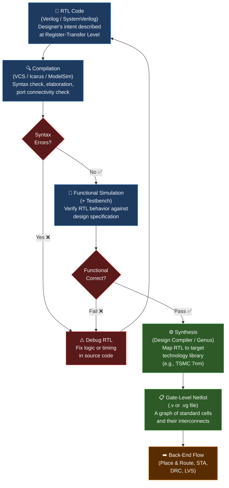

# Module 1: The Silicon Paradigm & Verilog Fundamentals

> **Repository:** VLSI & Digital Design — Interview Preparation & Conceptual Reference  
> **Author:** Shravana HS  
> **Standard:** IEEE 1364 / IEEE 1800 (SystemVerilog)  
> **Status:** 🟢 Active — Last Reviewed April 2026

---

## Table of Contents

1. [The Fundamental Paradigm Shift — Hardware vs. Software](#1-the-fundamental-paradigm-shift--hardware-vs-software)
2. [The Great Verilog Lie — `wire` vs. `reg`](#2-the-great-verilog-lie--wire-vs-reg)
3. [Language Ecosystem & IEEE Standards](#3-language-ecosystem--ieee-standards)
4. [The VLSI Front-End Design Flow](#4-the-vlsi-front-end-design-flow)
5. [Levels of Abstraction](#5-levels-of-abstraction)
6. [Sequential Logic & Resets](#6-sequential-logic--resets)

---

## 1. The Fundamental Paradigm Shift — Hardware vs. Software

The single most important concept in digital design is understanding that **Verilog is not a programming language — it is a hardware description language (HDL)**. You are not telling a processor *what to do*; you are describing *what to build* in silicon.

### 1.1 The C vs. Verilog Comparison

| Dimension | C (Software) | Verilog (Hardware) |
|:---|:---|:---|
| **Execution Model** | Sequential — one instruction at a time on a single CPU thread | Concurrent — all `always` and `assign` blocks execute simultaneously |
| **Time** | Abstract, OS-controlled, software clock ticks | Physical — governed by propagation delays through real gates |
| **Resource Model** | Runs on pre-existing CPU hardware; shares registers | **Synthesizes** hardware; every construct becomes a physical circuit element |
| **Loops** | `for` loops execute iteratively over time (N iterations = N clock cycles) | `for` loops **unroll in space** — a loop of N creates N copies of the hardware |
| **Memory** | Reads/writes to a shared, abstract address space | Memory = physical flip-flops or SRAM cells with real area and power cost |
| **Compilation Output** | Machine code (binary instructions for a CPU) | A **Netlist** (a graph of interconnected logic gates and flip-flops) |
| **"Variables"** | Stored in stack/heap RAM, updated over time | Describe **wire connections** or **register states** in a circuit |
| **Timing Bugs** | Race conditions in multi-threading | Setup/Hold time violations, Metastability, Clock skew |
| **Optimization** | Compiler re-orders instructions | Synthesizer re-maps logic to minimize area, power, or timing path |
| **Debugging** | `printf` / debugger breakpoints | Waveform analysis (GTKWave, Verdi) on signal transitions |

### 1.2 The Loop Paradigm — Time vs. Space

This is a critical distinction that trips up software engineers entering the hardware world.

```verilog
// ============================================================
// C Mental Model (WRONG way to think about hardware):
// A for loop runs N steps over time on a CPU.
// Total cycle cost: N iterations.
// ============================================================

// ============================================================
// Verilog Synthesis Reality:
// The synthesizer UNROLLS this loop into N parallel adders.
// It does NOT iterate — it instantiates hardware.
// Cost: N adders in AREA and POWER, but only 1 clock cycle latency.
// ============================================================
module loop_unroll_example (
    input  [3:0] a [0:3],   // 4 elements, each 4-bit wide
    output [3:0] out [0:3]
);
    genvar i;
    generate
        for (i = 0; i < 4; i = i + 1) begin : GEN_ADDER
            // This does NOT run 4 times sequentially.
            // This CREATES 4 separate adder circuits in silicon.
            assign out[i] = a[i] + 4'd1;
        end
    endgenerate
endmodule
```

> **🔥 Interview Trap**
>
> **Q: What does a `for` loop synthesize to?**
>
> A software engineer says: "It runs N times, taking N cycles."  
> **The correct answer:** It **unrolls spatially** — the synthesizer creates N *copies* of the logic block in parallel. All copies are active simultaneously. A loop body with a 4-bit adder unrolled 8 times synthesizes to **8 physical adders** with **1 cycle of latency** but **8x the area**.  
> This is why loop bounds in synthesizable RTL must be **statically determinable at compile time**.

---

## 2. The Great Verilog Lie — `wire` vs. `reg`

The naming convention in Verilog is a notorious source of confusion. The names suggest physical structures, but the **synthesis reality is determined entirely by context**, not by the keyword.

### 2.1 Physical Definitions

| Keyword | Physical Analogy | Driven By | Key Property |
|:---|:---|:---|:---|
| `wire` | A **physical wire** or metal trace on silicon | `assign` statements, module output ports | Cannot hold a value; it is always a function of its driver. If the driver goes high-Z, the wire is undefined. |
| `reg` | A **variable** that holds the last assigned value inside a procedural block | `always` / `initial` blocks | **Does NOT imply a flip-flop!** It is a storage element within the simulation kernel only. Synthesis determines the physical implementation. |

### 2.2 What Does `reg` Actually Synthesize To?

The physical hardware created from a `reg` depends entirely on *which procedural block* drives it:

| Procedural Context | Synthesized Hardware | Reason |
|:---|:---|:---|
| `always @(*)` (combinational) | **Combinational Logic** (Multiplexers, logic gates) | The block is sensitive to all inputs; no clock edge is required to update the output. |
| `always @(posedge clk)` (sequential) | **D Flip-Flop (DFF)** | Output only changes on a clock edge — the defining behavior of a DFF. |
| `always @(posedge clk or negedge rst_n)` | **DFF with Async Reset** | The reset is checked outside the clock edge, requiring an async-capable flip-flop. |
| `initial` block | **Nothing** (not synthesizable) | `initial` is for simulation only; it has no hardware equivalent. |

> **🔥 Interview Trap**
>
> **Q: Does declaring a signal as `reg` mean a flip-flop will be inferred?**
>
> **Absolutely not.** This is the most common misconception in Verilog.  
> - A `reg` inside `always @(*)` → synthesizes to **combinational logic** (no memory, no clock).  
> - A `reg` inside `always @(posedge clk)` → synthesizes to a **flip-flop**.  
>
> The keyword `reg` in Verilog simply means: *"this signal is assigned inside a procedural block."* The synthesizer infers the physical element from the **sensitivity list and the logic structure**, not from the data type keyword. SystemVerilog (IEEE 1800) largely solves this ambiguity with `logic`, `always_comb`, and `always_ff`.

```verilog
module reg_misconception_demo (
    input  wire clk,
    input  wire a, b,
    output reg  y_combo,   // reg keyword, but will synthesize to COMBINATIONAL logic
    output reg  y_seq      // reg keyword, and WILL synthesize to a Flip-Flop
);

    // Combinational: sensitive to all inputs, no clock edge.
    // Synthesizer sees: output changes with input => COMBINATIONAL GATE NETWORK
    always @(*) begin
        y_combo = a & b;   // This becomes an AND gate, NOT a register
    end

    // Sequential: sensitive to clock edge only.
    // Synthesizer sees: output changes on posedge clk => D FLIP-FLOP
    always @(posedge clk) begin
        y_seq <= a & b;    // This becomes a DFF capturing (a AND b)
    end

endmodule
```

---

## 3. Language Ecosystem & IEEE Standards

### 3.1 Verilog Standardization Timeline

| Standard | Year | Key Features |
|:---|:---|:---|
| **IEEE 1364-1995** (Verilog-95) | 1995 | First standardized version. Port declarations external to module header. Limited data types. |
| **IEEE 1364-2001** (Verilog-2001) | 2001 | **ANSI-style port declarations** (ports declared inline in module header). `generate` blocks introduced. Signed arithmetic support. `**` power operator. Multi-dimensional arrays. |
| **IEEE 1364-2005** (Verilog-2005) | 2005 | Minor improvements and clarifications. Final standalone Verilog standard. |
| **IEEE 1800-2005** (SystemVerilog) | 2005 | **Superset of Verilog.** Merged Verilog + hardware verification language (HVL). Adds `logic`, `always_comb`, `always_ff`, interfaces, classes, assertions (SVA), coverage. |
| **IEEE 1800-2012 / 2017** | 2012/2017 | Further refinements to SystemVerilog. Industry standard for RTL and verification today. |

### 3.2 Verilog vs. VHDL — The Industry Divide

| Dimension | Verilog / SystemVerilog | VHDL |
|:---|:---|:---|
| **Full Name** | Verilog Hardware Description Language | VHSIC Hardware Description Language |
| **Origin** | Gateway Design Automation (1984), Cadence | U.S. Department of Defense (1980s) |
| **Type System** | **Loosely typed** — implicit conversions are common | **Strongly typed** — explicit type casting is mandatory |
| **Syntax Style** | C-like — familiar to software engineers | Ada-like — verbose, explicit, formal |
| **Primary Industry** | Commercial — **Semiconductor (ASIC/FPGA)**, consumer electronics, CPU design | **Aerospace, defense, avionics** — where formal correctness is safety-critical |
| **Simulation Semantics** | 4-value logic (`0`, `1`, `X`, `Z`) defined in standard | 9-value std_logic from `IEEE.std_logic_1164` package |
| **Verification Ecosystem** | **SystemVerilog + UVM** (Universal Verification Methodology) is the industry standard | OSVVM (Open Source VHDL Verification Methodology) — less widely adopted |
| **Key Companies** | Intel, AMD, Qualcomm, Apple, NVIDIA, most startups | Lockheed Martin, Raytheon, BAE Systems, ESA |
| **Learning Curve** | Relatively accessible | Steeper — highly verbose and ceremonial |

> **🔥 Interview Trap**
>
> **Q: Why do aerospace companies prefer VHDL?**
>
> It's not just tradition — VHDL's **strong type system makes illegal signal connections a compile-time error**, not a runtime bug. In a flight control system or a satellite, a type mismatch should never silently pass through. VHDL enforces hardware correctness at the language level — the verbosity is a feature, not a bug. Verilog's implicit casting can cause subtle, dangerous bugs in high-assurance systems.

---

## 4. The VLSI Front-End Design Flow

The front-end flow transforms a designer's intent (described in RTL) into a technology-mapped gate-level netlist that can be handed off to the back-end physical design team.

### 4.1 The Flow — Mermaid Diagram



### 4.2 Key Definitions

#### What is a Netlist?
A **Netlist** is the output of synthesis. It is a structural Verilog file (`.v` or `.vg`) that describes a circuit as a **graph** where:
- **Nodes** = Standard cells (AND, OR, NAND, DFF, MUX) from the foundry's technology library.
- **Edges** = Wire connections between the pins of those cells.

It is no longer behavioral or RTL — it has been translated into actual physical gates tied to a specific technology node (e.g., 7nm FinFET, 28nm CMOS).

#### Why Does Synthesis Ignore `#10` Delays?
RTL code often contains simulation delays for testbench purposes:

```verilog
// Simulation Delay — IGNORED by synthesizer
// This does NOT create a "10-unit delay circuit."
// It is a simulation-only construct.
assign #10 y = a & b;  // Synthesizer strips this, creates a plain AND gate

// In a Testbench (safe to use delays here):
initial begin
    a = 0; b = 0;
    #10 a = 1;         // Apply input after 10 time units
    #10 b = 1;
end
```

The synthesizer treats `#delay` as a **comment**. The actual propagation delay in silicon is determined by the physical characteristics of the standard cells and wire lengths — not by the designer's `#` annotations in RTL.

> **🔥 Interview Trap**
>
> **Q: I wrote `assign #5 y = a & b;` in my module. Will the synthesized circuit have a 5 ns delay?**
>
> **No.** The `#5` is a simulation-time delay. The synthesis tool **completely ignores it**. The gate will have whatever propagation delay its standard cell characterization dictates (e.g., 0.12 ns at 25°C, nominal Vdd). Using `#` delays in RTL (not testbenches) is a dangerous habit — it masks real timing issues during simulation.

---

## 5. Levels of Abstraction

A circuit can be described at four distinct levels of abstraction in Verilog. Each level sacrifices some detail for a different design objective. A 2-to-1 Multiplexer (MUX) is the canonical example to demonstrate all four.

### 5.1 The Four Abstraction Levels

| Level | Description | Designer Focus | Typical Use |
|:---|:---|:---|:---|
| **Behavioral** | Describes *what* the circuit does algorithmically | Functionality / algorithm | Early design exploration, complex state machines |
| **Dataflow (RTL)** | Describes data flow using continuous assignments and Boolean equations | Signal transformations | Standard RTL design — synthesizable |
| **Gate / Structural** | Describes the circuit by instantiating primitive gates or sub-modules | Interconnection of logic gates | Post-synthesis netlists, structural verification |
| **Switch** | Describes the circuit in terms of NMOS/PMOS transistor networks | Transistor physics | Custom analog/mixed-signal blocks, SRAM designers |

### 5.2 2-to-1 MUX — All Four Abstraction Levels

**Logic Function:**  `Y = (S == 0) ? A : B`  
**Boolean Equation:** `Y = A·S̄ + B·S`

---

#### Level 1: Behavioral Abstraction

```verilog
// ============================================================
// BEHAVIORAL — Describes WHAT the MUX does.
// Uses procedural constructs (if-else / case).
// The synthesizer infers the appropriate hardware from the behavior.
// ============================================================
module mux2to1_behavioral (
    input  wire a,    // Input A (selected when sel = 0)
    input  wire b,    // Input B (selected when sel = 1)
    input  wire sel,  // Select line
    output reg  y     // Output (reg because driven in always block)
);
    always @(*) begin
        if (sel == 1'b0)
            y = a;   // No gates specified — synthesizer decides
        else
            y = b;
    end
endmodule
```

---

#### Level 2: Dataflow (RTL) Abstraction

```verilog
// ============================================================
// DATAFLOW — Describes HOW data flows using Boolean expressions.
// Continuous assignments model combinational logic directly.
// This is the "Register-Transfer Level" (RTL).
// ============================================================
module mux2to1_dataflow (
    input  wire a,
    input  wire b,
    input  wire sel,
    output wire y     // wire: driven by continuous assign
);
    // Y = A·(~SEL) + B·SEL
    // This is a direct mapping of the Boolean equation.
    // Synthesizer maps this to gates, but the equation is explicit.
    assign y = (~sel & a) | (sel & b);
endmodule
```

---

#### Level 3: Gate/Structural Abstraction

```verilog
// ============================================================
// STRUCTURAL / GATE-LEVEL — Describes the circuit by
// instantiating primitive gates (and, or, not).
// This is how a synthesized netlist looks.
// ============================================================
module mux2to1_structural (
    input  wire a,
    input  wire b,
    input  wire sel,
    output wire y
);
    wire sel_n;    // Internal wire for inverted select
    wire and1_out; // Output of first AND gate
    wire and2_out; // Output of second AND gate

    // Gate instantiation — explicit hardware primitives
    not  g_inv  (sel_n,    sel);          // Invert select
    and  g_and1 (and1_out, a, sel_n);    // A AND (NOT SEL)
    and  g_and2 (and2_out, b, sel);      // B AND SEL
    or   g_or   (y,        and1_out, and2_out); // OR the two AND terms

endmodule
```

---

#### Level 4: Switch (Transistor) Abstraction

```verilog
// ============================================================
// SWITCH LEVEL — Describes the circuit using individual MOSFET
// transistors (pmos, nmos).
// Rarely used in RTL design; used for custom cell design,
// SRAM, or analog-adjacent blocks.
// Note: This is a conceptual representation.
// ============================================================
module mux2to1_switch (
    input  wire a,
    input  wire b,
    input  wire sel,
    output wire y
);
    wire sel_n;     // Complementary select
    wire t1, t2;   // Internal transmission nodes

    // CMOS Transmission Gate for path A (passes when sel=0)
    // pmos: conducts when gate is LOW; nmos: conducts when gate is HIGH
    pmos pt1 (t1, a,   sel);    // pMOS: gate=sel, source=a, drain=t1
    nmos nt1 (t1, a,   sel_n);  // nMOS: gate=sel_n, source=a, drain=t1

    // Complementary select line
    not  g_inv  (sel_n, sel);

    // CMOS Transmission Gate for path B (passes when sel=1)
    pmos pt2 (t2, b,   sel_n);  // pMOS: gate=sel_n, source=b, drain=t2
    nmos nt2 (t2, b,   sel);    // nMOS: gate=sel, source=b, drain=t2

    // Wire-OR connection to output (only one path active at a time)
    assign y = t1 | t2;

endmodule
```

> **🔥 Interview Trap**
>
> **Q: At which abstraction level do you typically write RTL for synthesis?**
>
> The answer is **Behavioral and Dataflow** — often mixed together in the same file. A top-level chip is assembled at the **Structural** level (instantiating sub-modules and cores). The **Switch level** is almost never written by RTL designers; it belongs to the custom cell library team (Standard Cell Library development). If an interviewer asks you to code something at the switch level, they are testing your understanding of CMOS transistor physics, not RTL design skills.

---

## 6. Sequential Logic & Resets

Sequential logic is the foundation of all stateful digital systems. Unlike combinational logic, it depends on **both current inputs and past state**. The key element is the **D Flip-Flop (DFF)**.

### 6.1 Synchronous vs. Asynchronous Reset

| Property | Synchronous Reset | Asynchronous Reset |
|:---|:---|:---|
| **When does reset take effect?** | Only on the **active clock edge** — reset is sampled like a data input | **Immediately**, regardless of the clock state |
| **Sensitivity List** | `always @(posedge clk)` | `always @(posedge clk or negedge rst_n)` |
| **Reset Path** | Reset signal goes through the **data path (D input)** of the DFF | Reset signal goes to the **dedicated async reset pin (PRE/CLR)** of the DFF |
| **Glitch Sensitivity** | Immune to glitches on reset line (filtered by clock) | Susceptible — a noise spike on rst can spuriously reset the system |
| **Timing Analysis** | Reset is a normal data path; analyzed for setup time | Async reset has its own recovery/removal timing requirements |
| **Reset Removal (De-assertion)** | Clean — de-assertion is synchronous with clock | Requires **reset synchronizer** to prevent metastability on de-assertion |
| **Industry Preference** | FPGAs (dedicated sync resources) | ASICs — faster, guaranteed reset regardless of clock; must be synchronized |

### 6.2 D Flip-Flop with Active-Low Asynchronous Reset

```verilog
// ============================================================
// D FLIP-FLOP — Active-Low Asynchronous Reset
//
// The sensitivity list: @(posedge clk OR negedge rst_n)
//
// Priority is CRITICAL:
//   1. rst_n is checked FIRST in the if-else chain.
//      This maps to the async CLEAR pin on the physical DFF.
//   2. The clock edge case is checked SECOND.
//      This maps to the synchronous D-to-Q data path.
//
// The synthesizer reads this priority structure and
// instantiates a DFF with an asynchronous reset pin.
// ============================================================
module dff_async_reset (
    input  wire clk,    // System clock — positive edge triggered
    input  wire rst_n,  // Active-LOW asynchronous reset (0 = reset active)
    input  wire d,      // Data input
    output reg  q       // Registered output (maps to DFF Q pin)
);

    always @(posedge clk or negedge rst_n) begin
        //
        // PRIORITY 1: Check reset FIRST.
        // If rst_n goes LOW at ANY time (even mid-cycle),
        // the output is immediately forced to 0.
        // This check does NOT need the clock edge.
        //
        if (!rst_n) begin
            q <= 1'b0;   // Reset state — forced output

        //
        // PRIORITY 2: Normal clocked operation.
        // Only reached when reset is de-asserted (rst_n = 1).
        // On every rising edge of clk, capture input D into Q.
        //
        end else begin
            q <= d;      // Non-blocking assignment — models real DFF timing
        end
    end

endmodule
```

### 6.3 Why Non-Blocking Assignment (`<=`) is Mandatory in Sequential Logic

```verilog
// ============================================================
// CORRECT — Non-blocking assignment (<=)
// Models the physical behavior of a DFF:
// All right-hand sides (RHS) are evaluated first using
// current values, THEN all left-hand sides (LHS) are updated.
// This correctly models a pipeline of flip-flops.
// ============================================================
always @(posedge clk) begin
    q1 <= d;     // Step 1: RHS = d (current value)
    q2 <= q1;   // Step 1: RHS = q1 (CURRENT value, before q1 updates)
    // Step 2: q1 becomes d, q2 becomes old q1 — CORRECT pipeline behavior
end

// ============================================================
// WRONG — Blocking assignment (=) in sequential block
// Updates happen immediately, one after the other.
// q2 captures the NEW value of q1, not the old one.
// This models a SINGLE flop, not a 2-stage pipeline.
// This is a simulation mismatch / synthesis bug.
// ============================================================
always @(posedge clk) begin
    q1 = d;      // q1 is updated immediately
    q2 = q1;    // q2 captures the NEW q1 — SAME CYCLE DATA (BUG!)
end
```

> **🔥 Interview Trap**
>
> **Q: Can you use blocking assignments (`=`) in sequential `always` blocks?**
>
> Technically, the simulator will compile it — but it is **almost always a bug**. The rule of thumb:
> - `always @(posedge clk)` → **Always use `<=` (non-blocking)**. This models actual flip-flop behavior and prevents race conditions in simulation.
> - `always @(*)` → **Always use `=` (blocking)**. Combinational logic evaluates in a chain, which blocking assignment models correctly.
>
> Mixing these is a **synthesis-simulation mismatch** — the simulator and the synthesized gate-level netlist will behave differently. This is one of the most common and hardest-to-debug RTL bugs.

---

## Summary Cheat Sheet

| Concept | Key Takeaway |
|:---|:---|
| Hardware vs. Software | Verilog describes silicon structure, not CPU instructions. Concurrency is the default. |
| `wire` | A physical connection. Always driven. Has no memory. |
| `reg` | A simulation variable. Synthesizes to **gates** (in `always @(*)`) or **DFFs** (in `always @(posedge clk)`). |
| `for` loop | Unrolls **spatially** in synthesis. N iterations = N hardware copies, not N cycles. |
| `#delay` | A **simulation-only** construct. Completely ignored by the synthesizer. |
| Synthesis output | A **Netlist** — a graph of standard cells from the target technology library. |
| Non-blocking `<=` | Models real DFF behavior. Mandatory in sequential `always` blocks. |
| Async reset | Takes effect immediately on de-assertion of reset signal. Requires a reset synchronizer in real designs. |
| Behavioral > Structural | RTL is written Behaviorally/Dataflow. Chips are assembled Structurally. Switch level = transistor design. |
| Verilog vs. VHDL | Verilog: commercial semiconductor, loosely typed. VHDL: aerospace/defense, strongly typed. |

---

*Generated as part of the VLSI Interview Preparation Repository.*  
*Module 2 → Coming Next: Combinational Logic Design, Timing Analysis & Setup/Hold.*
