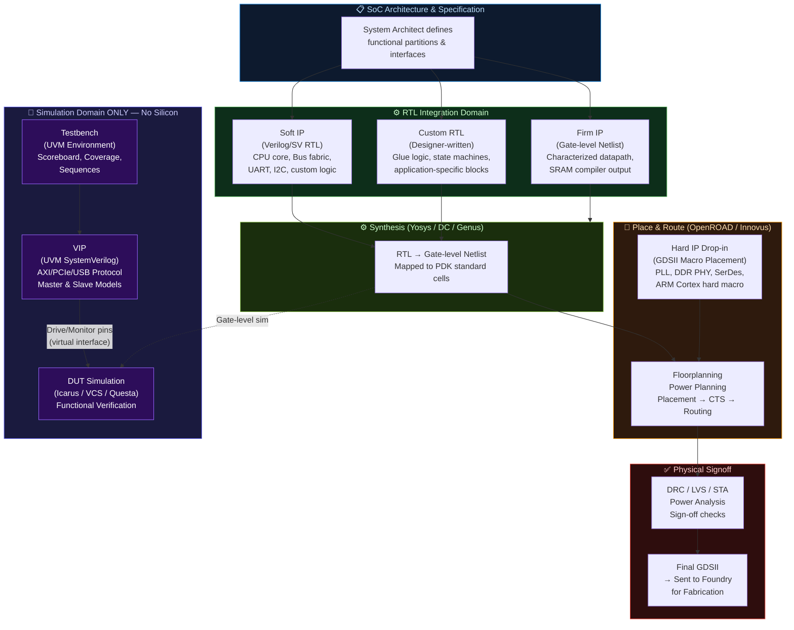
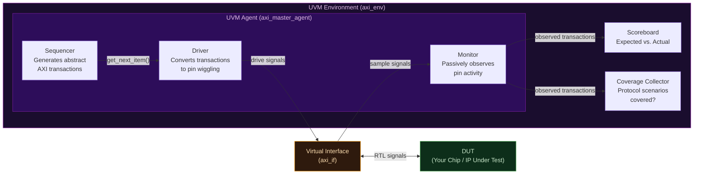
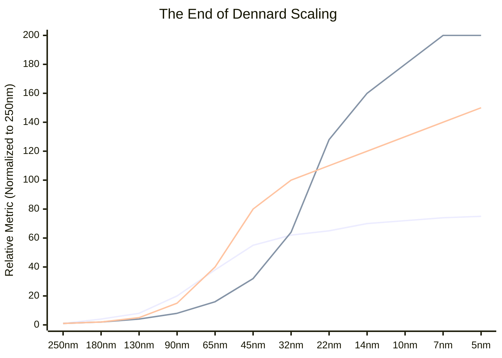
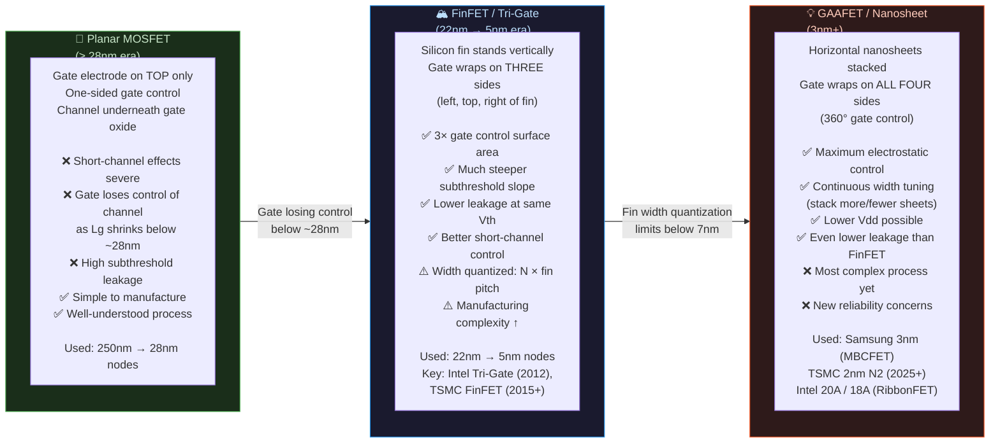

# Module 2: Silicon Real Estate — IPs & Technology Nodes

> **Repository:** VLSI & Digital Design — Interview Preparation & Conceptual Reference  
> **Author:** Shravana HS  
> **Standard:** IEEE 1364 / IEEE 1800 (SystemVerilog) & Process Technology  
> **Status:** 🟢 Active — Last Reviewed April 2026

---

## Table of Contents

1. [What is an IP Block?](#1-what-is-an-ip-block)
2. [The Four IP Categories](#2-the-four-ip-categories)
3. [IP Comparison Table](#3-ip-comparison-table)
4. [System Architecture — IP Plug-in Flow](#4-system-architecture--ip-plug-in-flow)
5. [The VIP Deep Dive](#5-the-vip-deep-dive)
6. [What Is a Technology Node?](#6-what-is-a-technology-node)
7. [The Modern Naming Convention — The Marketing Lie](#7-the-modern-naming-convention--the-marketing-lie)
8. [Moore's Law vs. Dennard Scaling](#8-moores-law-vs-dennard-scaling)
9. [PPA Trade-off Table — Shrinking Node Effects](#9-ppa-trade-off-table--shrinking-node-effects)
10. [The Leakage Crisis & RC Delay Problem](#10-the-leakage-crisis--rc-delay-problem)
11. [Transistor Evolution: Planar → FinFET → GAAFET](#11-transistor-evolution-planar--finfet--gaafet)
12. [Summary Cheat Sheet](#summary-cheat-sheet)

---

## 1. What is an IP Block?

An **IP (Intellectual Property) block** in the context of VLSI/SoC design is a reusable unit of logic that has been pre-designed, pre-verified, and licensed for integration into a larger chip. Rather than designing every sub-block from scratch (a USB controller, a DDR PHY, a CPU core), SoC teams license existing, battle-tested IP to dramatically reduce design time and risk.

The phrase **"Silicon Real Estate"** is apt: every IP block you integrate occupies a physical area on your chip's die, consumes power, and has strict timing requirements. The *type* of IP you license determines how much flexibility you have to reconfigure it — and at what cost in predictability.

IP blocks exist on a spectrum from maximally flexible (but unproven in your specific process) to maximally predictable (but completely inflexible).

---

## 2. The Four IP Categories

### 2.1 Soft IP

A **Soft IP** is delivered as synthesizable RTL source code — typically Verilog or VHDL files. It has not been synthesized or placed into any specific technology node. The integrating team runs it through their own synthesis and P&R flow.

**Key Characteristics:**
- Delivered as: `.v`, `.sv`, `.vhd` source files
- Technology-independent — re-synthesizable for any foundry or node (28nm, 7nm, TSMC, GF, etc.)
- **Maximally flexible** — the team can tweak timing constraints, add wrappers, or change target frequency
- **Zero guaranteed silicon performance** — area and power depend on the downstream synthesis run
- Must be re-verified after synthesis to the new technology

**Common Examples:** RISC-V CPU cores (e.g., SiFive E31, CVA6), open-source bus fabrics (AXI, AHB), UART controllers, I2C/SPI peripherals.

```verilog
// Example of a Soft IP delivery: UART Transmitter (RTL snippet)
// This .v file is what a customer receives.
// They synthesize it themselves against their chosen PDK.
module uart_tx #(
    parameter CLK_FREQ  = 100_000_000,  // Parameter: customer sets their clock
    parameter BAUD_RATE = 115_200
)(
    input  wire clk,
    input  wire rst_n,
    input  wire [7:0] data_in,
    input  wire       tx_start,
    output reg        tx_serial,
    output reg        tx_busy
);
    // RTL implementation...
    // Synthesizer maps this to the customer's target library.
endmodule
```

---

### 2.2 Firm IP

A **Firm IP** is a middle ground — it has been synthesized to a specific technology library and delivered as a **gate-level netlist**, but **placement and routing have NOT been performed**. The integrating team handles P&R themselves.

**Key Characteristics:**
- Delivered as: a **gate-level netlist** (`.v` file referencing specific standard cells), timing constraints (`.sdc`), and a liberty file (`.lib`)
- Technology-**dependent** — tied to a specific foundry and node
- Area and power are now **characterized** (predictable bounds exist)
- Still **spatially flexible** — the P&R tool can place cells wherever it fits
- The integrating team's P&R environment determines final routing quality

**Common Examples:** Some SRAM compilers, certain DSP datapaths delivered with a specific PDK characterized netlist.

```verilog
// Conceptual Firm IP: A gate-level netlist snippet (what the customer receives)
// This is NOT RTL — it references physical standard cells from a PDK.
// e.g., SkyWater 130nm standard cell names:
module fir_filter_firm (
    input  clk, rst_n,
    input  signed [15:0] data_in,
    output signed [31:0] data_out
);
    // Internal wires connecting standard cell instances
    wire n1, n2, n3;

    // Standard cell instantiation — technology-dependent!
    sky130_fd_sc_hd__and2_1  U1 (.A(clk),   .B(rst_n), .X(n1));
    sky130_fd_sc_hd__dfrtp_1 U2 (.CLK(clk), .D(n1),    .Q(n2), .RESET_B(rst_n));
    // ... hundreds more cells
endmodule
```

---

### 2.3 Hard IP

A **Hard IP** is a fully pre-designed, pre-placed, and pre-routed block. It is delivered as a **GDSII layout file** — the final silicon-ready geometric description of every transistor, wire, and via. The integrating team simply "drops it in" to their chip layout.

**Key Characteristics:**
- Delivered as: **GDSII** layout + LEF (abstract view for P&R) + timing models + functional models
- **Maximally predictable** — performance, power, and area are silicon-proven
- **Zero flexibility** — you cannot change internal logic, retarget to a different node, or modify timing paths
- The block is treated as a "black box" by the rest of the design team
- Tightly coupled to a **specific foundry, node, and flavor** (e.g., TSMC 5nm FinFET)

**Critical distinguishing property:** Hard IPs often include **analog circuits** or precision structures (Phase-Locked Loops, DDR PHYs, SerDes transceivers, SRAM arrays) that are *impossible* to reliably synthesize — they require hand-crafted transistor-level layout.

**Common Examples:** CPU cores from ARM (delivered as hard macros), PLL blocks, DDR4/LPDDR5 PHYs, PCIe SerDes, High-Speed USB PHYs, custom SRAM compilers.

> **🔥 Interview Trap**
>
> **Q: Can a Hard IP be re-used in a different technology node?**
>
> **Absolutely not.** A Hard IP is a fixed piece of GDSII geometry calibrated for one specific foundry process. The physical dimensions of transistors, metal pitches, and via rules are completely different between nodes.  
> Moving a TSMC 7nm Hard IP to a TSMC 5nm process requires a **complete redesign from scratch** — the geometry rules are incompatible.  
> This is why semiconductor companies pay ARM enormous licensing fees for **node-specific** hard macro versions of their CPU cores.

---

### 2.4 VIP — Verification IP

A **VIP (Verification IP)** is a **software component** written in SystemVerilog (using UVM — Universal Verification Methodology) that models the behavior of an interface protocol (e.g., AXI, PCIe, USB, AMBA) for the purpose of **functional verification in simulation**.

A VIP is **never synthesized into silicon.** It exists only in the simulation environment.

**Key Components of a VIP:**
- **Sequencer**: Generates protocol-compliant transaction sequences
- **Driver**: Translates abstract transactions into pin-level signal stimulus
- **Monitor**: Passively observes the DUT's interface signals and converts them back to transactions
- **Scoreboard**: Compares expected vs. actual transactions
- **Coverage Collector**: Tracks which protocol scenarios have been exercised

```systemverilog
// Conceptual AXI VIP Driver snippet (UVM-based, SystemVerilog)
// This RUNS IN SIMULATION ONLY — it is NOT synthesizable hardware.
// A VIP driver "pretends" to be an AXI master to drive your DUT.
class axi_master_driver extends uvm_driver #(axi_transaction);
    `uvm_component_utils(axi_master_driver)

    virtual axi_if vif; // Virtual interface handle to the DUT's AXI port

    task run_phase(uvm_phase phase);
        axi_transaction req;
        forever begin
            seq_item_port.get_next_item(req);   // Get transaction from sequencer

            // Drive the protocol signals on the virtual interface
            vif.AWVALID <= 1'b1;
            vif.AWADDR  <= req.addr;
            vif.AWLEN   <= req.burst_len;
            @(posedge vif.ACLK iff vif.AWREADY); // Wait for handshake

            vif.AWVALID <= 1'b0;
            // ... continue AXI write data channel...

            seq_item_port.item_done();
        end
    endtask
endclass
```

> **🔥 Interview Trap**
>
> **Q: Is a VIP a type of hardware IP? Will it be synthesized onto the chip?**
>
> **This is one of the most fundamental misconceptions in VLSI interviews.**  
> A VIP is **strictly a software/SystemVerilog verification component**. It is a piece of testbench infrastructure. It lives inside the simulation environment — it is **never synthesized, never placed, never routed, and never appears on the final chip**.  
>
> The confusion arises because "IP" is in the name. Remember:  
> - **Soft/Firm/Hard IP** → Goes on the chip. Synthesized (or pre-synthesized) hardware.  
> - **VIP** → Lives in the testbench. Simulation-only software that mimics a protocol master/slave.  
>
> Saying "I will synthesize the AXI VIP into my design" to an interviewer is an immediate red flag. VIPs are purchased to *test* your chip, not to *be part of* your chip.

---

## 3. IP Comparison Table

| Dimension | Soft IP | Firm IP | Hard IP | VIP (Verification IP) |
|:---|:---|:---|:---|:---|
| **Delivery Format** | RTL source (`.v`, `.sv`, `.vhd`) | Gate-level netlist + `.sdc` + `.lib` | GDSII layout + LEF + timing models | SystemVerilog / UVM class library |
| **Technology Portability** | **Fully portable** — any foundry, any node | **Node-specific** — one library, resynth needed for others | **Completely fixed** — one foundry, one node, one flavor | N/A — software; no silicon relevance |
| **Area Predictability** | Low — depends on your synthesis run | Medium — synthesis done; P&R adds variability | **High** — silicon-proven, characterized | N/A |
| **Timing Predictability** | Low | Medium | **Highest** — timing is part of the hard macro spec | N/A |
| **Power Predictability** | Low | Medium | **Highest** — SPICE-characterized | N/A |
| **Flexibility** | **Maximum** — can modify RTL, retarget | Moderate — can adjust P&R constraints | **Zero** — black box | **Maximum** — fully programmable in software |
| **Integration Effort** | High — full synthesis + P&R + verification | Medium — P&R + verification | Low — drop-in placement + LVS | High — requires UVM testbench infrastructure |
| **Typical Use Case** | CPU cores, bus fabrics, controllers (UART, I2C, SPI) | Characterized datapaths, some SRAM compilers | PLLs, DDR PHYs, SerDes, ARM Cortex hard macros | Protocol compliance testing — AXI, PCIe, USB, DDR |
| **Synthesized to Silicon?** | ✅ Yes | ✅ Yes | ✅ Yes (already done) | ❌ **Never** |
| **Source Code Visible?** | ✅ Yes (to licensee) | ❌ No (netlist only) | ❌ No (GDSII only) | ✅ Yes |

---

## 4. System Architecture — IP Plug-in Flow

The following diagram shows where each IP type enters the SoC integration flow. Notice that the VIP exists entirely outside the hardware path — it only interacts with the Design Under Test (DUT) through simulation interfaces.



---

## 5. The VIP Deep Dive

A complete UVM VIP architecture for a single protocol consists of the following components working together:



### 5.1 Why VIPs are Software, Not Hardware

The decisive technical reason is **object-oriented polymorphism and dynamic memory allocation** — constructs that have no hardware equivalent:

| VIP Feature | Hardware Equivalent | Why it Cannot be Synthesized |
|:---|:---|:---|
| `class` and `extends` (OOP) | None | Classes require dynamic vtable lookup — impossible in static RTL |
| `new()` — dynamic allocation | None | Hardware has no heap or runtime memory allocator |
| `mailbox`, `semaphore` | Approximate: FIFOs, arbiters | SystemVerilog mailboxes have no direct one-to-one RTL primitive |
| `uvm_phase` sequencing | None | Phase management is a software scheduler concept |
| `$display`, `$error` | None | Simulation system tasks have no silicon output |
| `fork...join` threads | No direct equivalent | Concurrency in hardware is structural, not thread-based |

---

## 6. What Is a Technology Node?

A **technology node** (also called a **process node** or **process technology**) historically referred to the **physical gate length of the transistor's channel** — the distance between the source and drain in a MOSFET, measured in nanometers (nm).

This measurement was chosen because the gate length is the primary factor controlling:
- **Transistor switching speed** (shorter channel → faster switching)
- **Transistor density** (shorter gate → smaller cell area → more transistors per mm²)
- **Power per transistor** (smaller device → lower switching energy)

### Historical Reality (where the naming was honest)

| Technology Node | Approximate Gate Length | Era | Key Products |
|:---|:---|:---|:---|
| **250 nm** | ~250 nm actual gate | 1997 | Pentium II |
| **130 nm** | ~130 nm actual gate | 2001 | Pentium III, PowerPC G4 |
| **90 nm** | ~90 nm actual gate | 2003 | Pentium 4 "Prescott" |
| **65 nm** | ~65 nm actual gate | 2005 | Intel Core 2 Duo |
| **45 nm** | ~45 nm actual gate | 2007 | Intel Penryn (first with High-K metal gate) |
| **32 nm** | ~32 nm actual gate | 2010 | Intel Westmere |
| **22 nm** | ~22 nm actual gate | 2012 | Intel Ivy Bridge (first FinFET in prod.) |

**At and beyond the 22nm node, the node name diverged from the actual gate length.** The "node number" became a **marketing label** rather than a physical measurement.

---

## 7. The Modern Naming Convention — The Marketing Lie

> **🔥 Interview Trap**
>
> **Q: A chip is fabricated on TSMC's "3nm" process. Does that mean the transistors have a 3 nm gate length?**
>
> **No — and this is the single most important thing to understand about modern process nodes.**
>
> At modern nodes (sub-20nm), the "node name" is a **competitive marketing number** with no direct, agreed-upon correlation to any single physical dimension.
>
> - **TSMC "3nm" (N3):** The actual effective gate length (Lg) is estimated around 12–15 nm. The "3nm" refers to a density and performance target, verified by TSMC's internal metrics, not to any single physical feature.
> - **Intel "7nm" (now rebranded "Intel 4"):** Comparable in transistor density to TSMC 5nm, despite the larger number.
> - **Samsung "3nm" (MBCFET):** Uses Gate-All-Around technology, but the physical gate length is similarly not 3nm.
>
> The numbers became a race to the bottom in marketing. When Samsung announced 3nm before TSMC, TSMC accelerated their announcement. Neither number reflects a real physical dimension.
>
> **The correct way to compare nodes is by:**
> 1. **Transistor density** (MTr/mm² — million transistors per square millimeter)
> 2. **Standard cell height** (in metal pitch units)
> 3. **SRAM bit-cell area** (a standard benchmark)
> 4. **Benchmark performance** (e.g., SPECint, IPC at fixed voltage/frequency)

### Node Density Reality Check

| Marketed Node | Company | Approx. Transistor Density | Actual Physical Comparison |
|:---|:---|:---|:---|
| 7nm | TSMC | ~91 MTr/mm² | Actual Lg ~18–20nm |
| 7nm | Samsung | ~95 MTr/mm² | Actual Lg ~16–18nm |
| 10nm | Intel | ~100 MTr/mm² | Denser than competitor 7nm nodes |
| 5nm | TSMC | ~171 MTr/mm² | Actual Lg ~12–14nm |
| 3nm | TSMC N3E | ~292 MTr/mm² | Actual Lg still > 10nm |
| 3nm | Samsung | ~141 MTr/mm² | GAAFET, but lower density than TSMC 5nm |

---

## 8. Moore's Law vs. Dennard Scaling

These two empirical observations governed semiconductor scaling for decades. Understanding **why Dennard Scaling died but Moore's Law limps on** is essential for any semiconductor interview.

### 8.1 Moore's Law (1965 — Observation)

**Gordon Moore's Observation (Intel co-founder):**

> *"The number of transistors on an integrated circuit doubles approximately every two years."*

- This is an **empirical observation**, not a law of physics — it is a self-fulfilling industry roadmap.
- It describes **density scaling** (transistors per mm²), not performance scaling.
- Moore's Law has **slowed dramatically** at sub-10nm nodes due to the extreme cost and physical difficulty of patterning, but it has not completely ended.
- At 3nm, extreme ultraviolet (EUV) lithography with multiple patterning is required — a single layer can cost millions of dollars per mask set.

### 8.2 Dennard Scaling (1974 — The Golden Era)

**Robert Dennard's Observation (IBM):**

> *"If you shrink a transistor's linear dimensions by a factor of κ, then for constant electric field, voltage scales by 1/κ, current scales by 1/κ, and therefore power density remains constant."*

In other words: **shrink the transistor, shrink the voltage, performance improves, and power stays the same.** This gave the industry "free" performance improvements for decades — every two years, a new node gave you ~2× transistors at the same power envelope.

### 8.3 The Death of Dennard Scaling (~2005–2007)

**Dennard Scaling broke down because voltage could not continue to scale with physical dimensions.** The culprit: **leakage current**.

As transistor dimensions shrank below ~90nm, the voltage could not scale proportionally because:
1. **Threshold voltage (Vth) hit a floor** — reducing Vth below ~0.3–0.4V causes unacceptable **subthreshold leakage** (current flows even when the transistor is "off").
2. **Gate oxide thinned to atomic limits** — at ~1.2nm SiO₂, direct quantum tunneling through the gate dielectric caused exponential **gate leakage current**.
3. **Short-channel effects** — source-to-drain leakage even with gate off.

**Result:** Clock speeds plateaued around 3–4 GHz (circa 2004). More transistors no longer automatically meant faster or lower-power chips.



> **🔥 Interview Trap**
>
> **Q: If we have 2× more transistors at every new node (Moore's Law), why did clock speeds stop improving after ~2004?**
>
> This is a **Moore's Law vs. Dennard Scaling** distinction question.  
> - **Moore's Law** (density) is about how many transistors fit per mm² — it continues (slowly).  
> - **Dennard Scaling** (power-constrained frequency improvement) **died around 2005** because leakage current prevents voltage from scaling below ~0.7–0.8V for high-performance logic.  
>
> Without voltage scaling, the power budget prevents running faster: `P = α·C·V²·f`. Holding V constant means you cannot increase `f` without blowing your thermal envelope (100W+ chips generate too much heat for air cooling).  
> The industry's answer was **multi-core architectures** — instead of one fast core, put many efficient cores and exploit **parallel workloads** instead of single-thread frequency.

---

## 9. PPA Trade-off Table — Shrinking Node Effects

PPA (**Power, Performance, Area**) is the universal design trade-off space in VLSI. Shrinking a design to a newer node has a complex, non-uniform effect on all three axes.

| Effect | 250nm → 90nm (Classical Scaling Era) | 90nm → 5nm (Post-Dennard Era) |
|:---|:---|:---|
| **Active Power** (`P = α·C·V²·f`) | ✅ Decreases — V shrinks by 1/κ, C shrinks, f increases | ⚠️ Marginal improvement — C and V reduce, but α (activity) increases with more logic |
| **Static Leakage Power** | ✅ Negligible — Vgs < Vth leakage was minimal | ❌ **Major crisis** — subthreshold leakage + gate tunneling leakage dominates idle power |
| **Performance (max frequency)** | ✅ Improves — shorter gate, faster switching | ⚠️ Marginal — frequency capped by thermal limits; voltage cannot scale with dimension |
| **Transistor Density** | ✅ ~2× per generation | ✅ Continues (with EUV, multi-patterning) — but at enormous cost |
| **Wire (RC) Delay** | ✅ Acceptable — wires shortened proportionally | ❌ **Worsening** — metal pitches shrink but resistivity increases (narrow wires); RC delay grows |
| **Process Complexity & Cost** | Low | Extreme — FinFET, GAA, EUV, multiple patterning, CMP |
| **Yield** | High | Lower — more complex process = more defect opportunities |
| **Design Cost (NRE)** | Low | Extreme — 5nm tape-out can cost $100M+ in mask sets alone |

---

## 10. The Leakage Crisis & RC Delay Problem

### 10.1 Leakage Power — The Silent Killer

In the post-Dennard era, **leakage power** often accounts for 30–50% of total chip power in modern SoCs, even when the chip is idle.

```
Total Power = Dynamic Power + Static (Leakage) Power

Dynamic:  P_dyn  = α × C × V² × f
Static:   P_leak = I_leak × V_dd

I_leak = Sum of:
  1. Subthreshold leakage  — I_sub  ∝ e^(Vgs - Vth) / nkT  (exponential in Vth)
  2. Gate oxide leakage    — I_gate ∝ e^(-t_ox)             (exponential in oxide thickness)
  3. Junction leakage      — I_jxn  (reverse-biased diode leakage at drain/body junction)
  4. GIDL leakage          — Gate-Induced Drain Leakage (at sub-threshold Vds)
```

**Mitigation Strategies:** Multi-Vth cells (High-Vt for low-leakage, Low-Vt for high-speed), power gating (MTCMOS), voltage scaling, FinFET geometry (better electrostatic gate control → lower leakage).

### 10.2 RC Delay — The Interconnect Bottleneck

At advanced nodes, the **transistor itself is no longer the speed bottleneck** — the **wire is**.

```
Wire RC Delay: τ = R × C
  R (resistance) = ρ × L / A   (ρ increases as wire cross-section shrinks)
  C (capacitance) = ε × A / d  (wire-to-wire capacitance increases with tighter spacing)

At 7nm:
  → Wire pitch is ~28nm; Cu resistivity increases due to surface/grain scattering
  → RC delay of long global wires can dominate timing more than gate delay
  → Solution: Cobalt/Ruthenium local interconnects (lower ρ at small dimensions),
               Low-K dielectric (reduces C), or architectural changes (chiplets, UCIe)
```

---

## 11. Transistor Evolution: Planar → FinFET → GAAFET

The fundamental problem driving all transistor innovation is **electrostatic control** — the gate's ability to completely deplete the channel and stop current flow when Vgs < Vth.



### 11.1 The Physical Structure Comparison

| Property | Planar MOSFET | FinFET (Tri-Gate) | GAAFET (Nanosheet) |
|:---|:---|:---|:---|
| **Gate Contact Sides** | 1 (top only) | 3 (tri-gate) | 4 (all around — 360°) |
| **Electrostatic Control** | Weakest | Good | **Best** |
| **Subthreshold Swing** | ~80–100 mV/dec | ~65–70 mV/dec | **~60 mV/dec** (ideal limit) |
| **Width Quantization** | Continuous | Discrete (N fins) | **Continuous** (sheet stacking) |
| **Leakage Current (Ioff)** | Highest | Lower | **Lowest** |
| **Process Complexity** | Low | Medium | **High** |
| **Node Introduction** | All nodes until 28nm | 22nm (Intel), 16nm (TSMC) | 3nm (Samsung), 2nm (TSMC) |
| **Power Advantage** | Baseline | ~30–50% less power vs. Planar | ~30% less power vs. FinFET |
| **Key Innovator** | Bell Labs / all foundries | Intel (Tri-Gate, 2012) | IBM Research, Samsung, TSMC |

---

## 12. Summary Cheat Sheet

| Concept / IP | Key Takeaway / Interview Statement |
|:---|:---|
| **Soft IP** | Synthesizable RTL source; maximally flexible; re-synthesized by integrator. |
| **Firm IP** | Gate-level netlist; technology-specific; area/power bounded but routing flexible. |
| **Hard IP** | Silicon-proven GDSII black box; zero flexibility; one foundry/node. |
| **VIP** | **Never synthesized.** Simulation-only software that emulates protocols. |
| **3nm lie** | Modern node names are marketing targets, not physical dimensions. |
| **Dennard Scaling** | Dead since ~2005; why clock speeds plateaued and multi-core began. |
| **Leakage Power** | Dominant dark power; mitigated by High-K, FinFET, multi-Vth. |
| **Planar → FinFET** | 3-sided gate control; lower leakage; introduced at 22nm (Intel). |
| **FinFET → GAAFET** | 4-sided gate control; required at 3nm and below for continuous sizing. |

---

*Module 3 → The RTL-to-GDSII Toolchain & Full Adder Case Study*
