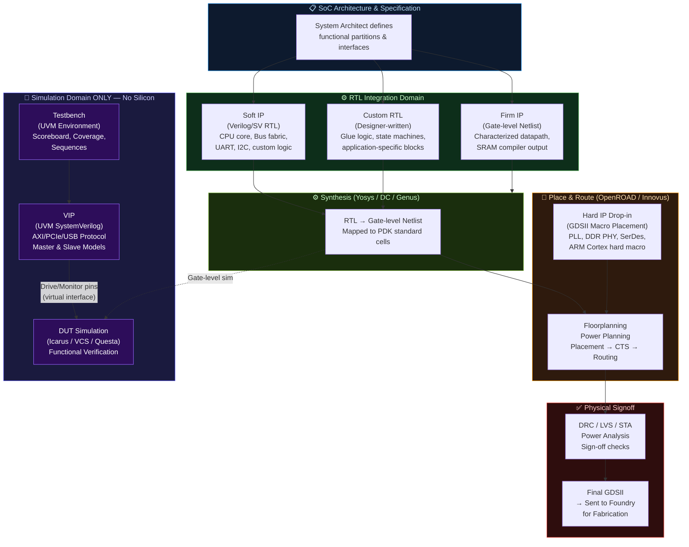
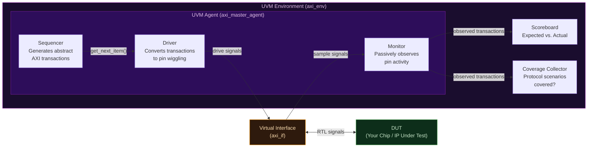

# Module 2: The Silicon Real Estate — VLSI IPs

> **Repository:** VLSI & Digital Design — Interview Preparation & Conceptual Reference  
> **Author:** Shravana HS  
> **Standard:** IEEE 1364 / IEEE 1800 (SystemVerilog)  
> **Status:** 🟢 Active — Last Reviewed April 2026

---

## Table of Contents

1. [What is an IP Block?](#1-what-is-an-ip-block)
2. [The Four IP Categories](#2-the-four-ip-categories)
3. [IP Comparison Table](#3-ip-comparison-table)
4. [System Architecture — IP Plug-in Flow](#4-system-architecture--ip-plug-in-flow)
5. [The VIP Deep Dive](#5-the-vip-deep-dive)
6. [Summary Cheat Sheet](#summary-cheat-sheet)

---

## 1. What is an IP Block?

An **IP (Intellectual Property) block** in the context of VLSI/SoC design is a reusable unit of logic that has been pre-designed, pre-verified, and licensed for integration into a larger chip. Rather than designing every sub-block from scratch (a USB controller, a DDR PHY, a CPU core), SoC teams license existing, battle-tested IP to dramatically reduce design time and risk.

The phrase **"Silicon Real Estate"** is apt: every IP block you integrate occupies a physical area on your chip's die, consumes power, and has strict timing requirements. The *type* of IP you license determines how much flexibility you have to reconfigure it — and at what cost in predictability.

IP blocks exist on a spectrum from maximally flexible (but unproven in your specific process) to maximally predictable (but completely inflexible).

---

## 2. The Four IP Categories

### 2.1 Soft IP

A **Soft IP** is delivered as synthesizable RTL source code — typically Verilog or VHDL files. It has not been synthesized or placed into any specific technology node. The integrating team runs it through their own synthesis and P&R flow.

**Key Characteristics:**
- Delivered as: `.v`, `.sv`, `.vhd` source files
- Technology-independent — re-synthesizable for any foundry or node (28nm, 7nm, TSMC, GF, etc.)
- **Maximally flexible** — the team can tweak timing constraints, add wrappers, or change target frequency
- **Zero guaranteed silicon performance** — area and power depend on the downstream synthesis run
- Must be re-verified after synthesis to the new technology

**Common Examples:** RISC-V CPU cores (e.g., SiFive E31, CVA6), open-source bus fabrics (AXI, AHB), UART controllers, I2C/SPI peripherals.

```verilog
// Example of a Soft IP delivery: UART Transmitter (RTL snippet)
// This .v file is what a customer receives.
// They synthesize it themselves against their chosen PDK.
module uart_tx #(
    parameter CLK_FREQ  = 100_000_000,  // Parameter: customer sets their clock
    parameter BAUD_RATE = 115_200
)(
    input  wire clk,
    input  wire rst_n,
    input  wire [7:0] data_in,
    input  wire       tx_start,
    output reg        tx_serial,
    output reg        tx_busy
);
    // RTL implementation...
    // Synthesizer maps this to the customer's target library.
endmodule
```

---

### 2.2 Firm IP

A **Firm IP** is a middle ground — it has been synthesized to a specific technology library and delivered as a **gate-level netlist**, but **placement and routing have NOT been performed**. The integrating team handles P&R themselves.

**Key Characteristics:**
- Delivered as: a **gate-level netlist** (`.v` file referencing specific standard cells), timing constraints (`.sdc`), and a liberty file (`.lib`)
- Technology-**dependent** — tied to a specific foundry and node
- Area and power are now **characterized** (predictable bounds exist)
- Still **spatially flexible** — the P&R tool can place cells wherever it fits
- The integrating team's P&R environment determines final routing quality

**Common Examples:** Some SRAM compilers, certain DSP datapaths delivered with a specific PDK characterized netlist.

```verilog
// Conceptual Firm IP: A gate-level netlist snippet (what the customer receives)
// This is NOT RTL — it references physical standard cells from a PDK.
// e.g., SkyWater 130nm standard cell names:
module fir_filter_firm (
    input  clk, rst_n,
    input  signed [15:0] data_in,
    output signed [31:0] data_out
);
    // Internal wires connecting standard cell instances
    wire n1, n2, n3;

    // Standard cell instantiation — technology-dependent!
    sky130_fd_sc_hd__and2_1  U1 (.A(clk),   .B(rst_n), .X(n1));
    sky130_fd_sc_hd__dfrtp_1 U2 (.CLK(clk), .D(n1),    .Q(n2), .RESET_B(rst_n));
    // ... hundreds more cells
endmodule
```

---

### 2.3 Hard IP

A **Hard IP** is a fully pre-designed, pre-placed, and pre-routed block. It is delivered as a **GDSII layout file** — the final silicon-ready geometric description of every transistor, wire, and via. The integrating team simply "drops it in" to their chip layout.

**Key Characteristics:**
- Delivered as: **GDSII** layout + LEF (abstract view for P&R) + timing models + functional models
- **Maximally predictable** — performance, power, and area are silicon-proven
- **Zero flexibility** — you cannot change internal logic, retarget to a different node, or modify timing paths
- The block is treated as a "black box" by the rest of the design team
- Tightly coupled to a **specific foundry, node, and flavor** (e.g., TSMC 5nm FinFET)

**Critical distinguishing property:** Hard IPs often include **analog circuits** or precision structures (Phase-Locked Loops, DDR PHYs, SerDes transceivers, SRAM arrays) that are *impossible* to reliably synthesize — they require hand-crafted transistor-level layout.

**Common Examples:** CPU cores from ARM (delivered as hard macros), PLL blocks, DDR4/LPDDR5 PHYs, PCIe SerDes, High-Speed USB PHYs, custom SRAM compilers.

> **🔥 Interview Trap**
>
> **Q: Can a Hard IP be re-used in a different technology node?**
>
> **Absolutely not.** A Hard IP is a fixed piece of GDSII geometry calibrated for one specific foundry process. The physical dimensions of transistors, metal pitches, and via rules are completely different between nodes.  
> Moving a TSMC 7nm Hard IP to a TSMC 5nm process requires a **complete redesign from scratch** — the geometry rules are incompatible.  
> This is why semiconductor companies pay ARM enormous licensing fees for **node-specific** hard macro versions of their CPU cores.

---

### 2.4 VIP — Verification IP

A **VIP (Verification IP)** is a **software component** written in SystemVerilog (using UVM — Universal Verification Methodology) that models the behavior of an interface protocol (e.g., AXI, PCIe, USB, AMBA) for the purpose of **functional verification in simulation**.

A VIP is **never synthesized into silicon.** It exists only in the simulation environment.

**Key Components of a VIP:**
- **Sequencer**: Generates protocol-compliant transaction sequences
- **Driver**: Translates abstract transactions into pin-level signal stimulus
- **Monitor**: Passively observes the DUT's interface signals and converts them back to transactions
- **Scoreboard**: Compares expected vs. actual transactions
- **Coverage Collector**: Tracks which protocol scenarios have been exercised

```systemverilog
// Conceptual AXI VIP Driver snippet (UVM-based, SystemVerilog)
// This RUNS IN SIMULATION ONLY — it is NOT synthesizable hardware.
// A VIP driver "pretends" to be an AXI master to drive your DUT.
class axi_master_driver extends uvm_driver #(axi_transaction);
    `uvm_component_utils(axi_master_driver)

    virtual axi_if vif; // Virtual interface handle to the DUT's AXI port

    task run_phase(uvm_phase phase);
        axi_transaction req;
        forever begin
            seq_item_port.get_next_item(req);   // Get transaction from sequencer

            // Drive the protocol signals on the virtual interface
            vif.AWVALID <= 1'b1;
            vif.AWADDR  <= req.addr;
            vif.AWLEN   <= req.burst_len;
            @(posedge vif.ACLK iff vif.AWREADY); // Wait for handshake

            vif.AWVALID <= 1'b0;
            // ... continue AXI write data channel...

            seq_item_port.item_done();
        end
    endtask
endclass
```

> **🔥 Interview Trap**
>
> **Q: Is a VIP a type of hardware IP? Will it be synthesized onto the chip?**
>
> **This is one of the most fundamental misconceptions in VLSI interviews.**  
> A VIP is **strictly a software/SystemVerilog verification component**. It is a piece of testbench infrastructure. It lives inside the simulation environment — it is **never synthesized, never placed, never routed, and never appears on the final chip**.  
>
> The confusion arises because "IP" is in the name. Remember:  
> - **Soft/Firm/Hard IP** → Goes on the chip. Synthesized (or pre-synthesized) hardware.  
> - **VIP** → Lives in the testbench. Simulation-only software that mimics a protocol master/slave.  
>
> Saying "I will synthesize the AXI VIP into my design" to an interviewer is an immediate red flag. VIPs are purchased to *test* your chip, not to *be part of* your chip.

---

## 3. IP Comparison Table

| Dimension | Soft IP | Firm IP | Hard IP | VIP (Verification IP) |
|:---|:---|:---|:---|:---|
| **Delivery Format** | RTL source (`.v`, `.sv`, `.vhd`) | Gate-level netlist + `.sdc` + `.lib` | GDSII layout + LEF + timing models | SystemVerilog / UVM class library |
| **Technology Portability** | **Fully portable** — any foundry, any node | **Node-specific** — one library, resynth needed for others | **Completely fixed** — one foundry, one node, one flavor | N/A — software; no silicon relevance |
| **Area Predictability** | Low — depends on your synthesis run | Medium — synthesis done; P&R adds variability | **High** — silicon-proven, characterized | N/A |
| **Timing Predictability** | Low | Medium | **Highest** — timing is part of the hard macro spec | N/A |
| **Power Predictability** | Low | Medium | **Highest** — SPICE-characterized | N/A |
| **Flexibility** | **Maximum** — can modify RTL, retarget | Moderate — can adjust P&R constraints | **Zero** — black box | **Maximum** — fully programmable in software |
| **Integration Effort** | High — full synthesis + P&R + verification | Medium — P&R + verification | Low — drop-in placement + LVS | High — requires UVM testbench infrastructure |
| **Typical Use Case** | CPU cores, bus fabrics, controllers (UART, I2C, SPI) | Characterized datapaths, some SRAM compilers | PLLs, DDR PHYs, SerDes, ARM Cortex hard macros | Protocol compliance testing — AXI, PCIe, USB, DDR |
| **Synthesized to Silicon?** | ✅ Yes | ✅ Yes | ✅ Yes (already done) | ❌ **Never** |
| **Source Code Visible?** | ✅ Yes (to licensee) | ❌ No (netlist only) | ❌ No (GDSII only) | ✅ Yes |

---

## 4. System Architecture — IP Plug-in Flow

The following diagram shows where each IP type enters the SoC integration flow. Notice that the VIP exists entirely outside the hardware path — it only interacts with the Design Under Test (DUT) through simulation interfaces.



---

## 5. The VIP Deep Dive

A complete UVM VIP architecture for a single protocol consists of the following components working together:



### 5.1 Why VIPs are Software, Not Hardware

The decisive technical reason is **object-oriented polymorphism and dynamic memory allocation** — constructs that have no hardware equivalent:

| VIP Feature | Hardware Equivalent | Why it Cannot be Synthesized |
|:---|:---|:---|
| `class` and `extends` (OOP) | None | Classes require dynamic vtable lookup — impossible in static RTL |
| `new()` — dynamic allocation | None | Hardware has no heap or runtime memory allocator |
| `mailbox`, `semaphore` | Approximate: FIFOs, arbiters | SystemVerilog mailboxes have no direct one-to-one RTL primitive |
| `uvm_phase` sequencing | None | Phase management is a software scheduler concept |
| `$display`, `$error` | None | Simulation system tasks have no silicon output |
| `fork...join` threads | No direct equivalent | Concurrency in hardware is structural, not thread-based |

---

## Summary Cheat Sheet

| IP Type | One-Line Definition | Key Interview Statement |
|:---|:---|:---|
| **Soft IP** | Synthesizable RTL source code | "Maximally flexible; zero a priori timing guarantee; re-synthesized by the integrator." |
| **Firm IP** | Gate-level netlist, not yet placed | "Technology-specific netlist; area/power bounded but routing flexible." |
| **Hard IP** | Pre-placed, pre-routed GDSII macro | "Silicon-proven black box; zero flexibility; one foundry, one node forever." |
| **VIP** | UVM/SV testbench component | "**Never synthesized.** Simulation-only software that emulates a protocol interface for DUT verification." |

---

*Module 3 → The Physics of Scaling & Technology Nodes*
