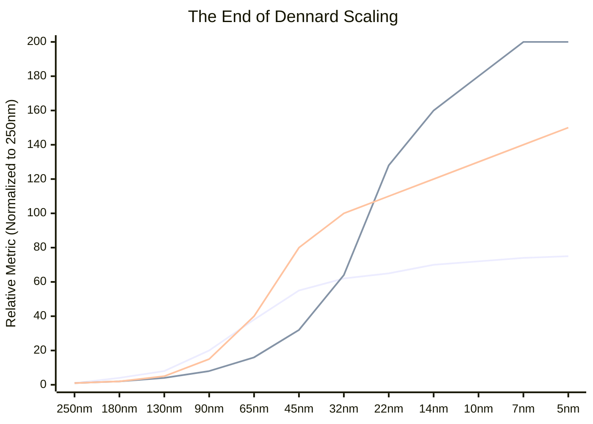
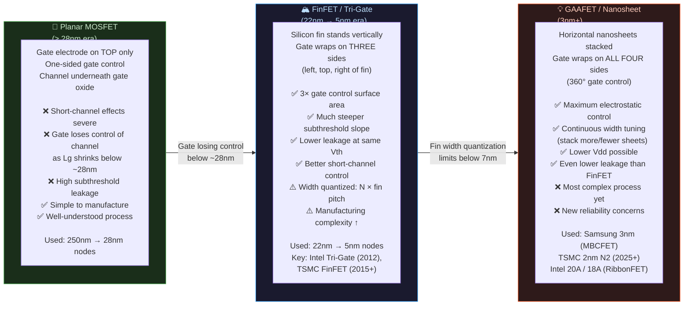

# Module 3: The Physics of Scaling & Technology Nodes

> **Repository:** VLSI & Digital Design — Interview Preparation & Conceptual Reference  
> **Author:** Shravana HS  
> **Standard:** Process Technology & Semiconductor Physics  
> **Status:** 🟢 Active — Last Reviewed April 2026

---

## Table of Contents

1. [What Is a Technology Node?](#1-what-is-a-technology-node)
2. [The Modern Naming Convention — The Marketing Lie](#2-the-modern-naming-convention--the-marketing-lie)
3. [Moore's Law vs. Dennard Scaling](#3-moores-law-vs-dennard-scaling)
4. [PPA Trade-off Table — Shrinking Node Effects](#4-ppa-trade-off-table--shrinking-node-effects)
5. [The Leakage Crisis & RC Delay Problem](#5-the-leakage-crisis--rc-delay-problem)
6. [Transistor Evolution: Planar → FinFET → GAAFET](#6-transistor-evolution-planar--finfet--gaafet)
7. [Summary Cheat Sheet](#summary-cheat-sheet)

---

## 1. What Is a Technology Node?

A **technology node** (also called a **process node** or **process technology**) historically referred to the **physical gate length of the transistor's channel** — the distance between the source and drain in a MOSFET, measured in nanometers (nm).

This measurement was chosen because the gate length is the primary factor controlling:
- **Transistor switching speed** (shorter channel → faster switching)
- **Transistor density** (shorter gate → smaller cell area → more transistors per mm²)
- **Power per transistor** (smaller device → lower switching energy)

### Historical Reality (where the naming was honest)

| Technology Node | Approximate Gate Length | Era | Key Products |
|:---|:---|:---|:---|
| **250 nm** | ~250 nm actual gate | 1997 | Pentium II |
| **130 nm** | ~130 nm actual gate | 2001 | Pentium III, PowerPC G4 |
| **90 nm** | ~90 nm actual gate | 2003 | Pentium 4 "Prescott" |
| **65 nm** | ~65 nm actual gate | 2005 | Intel Core 2 Duo |
| **45 nm** | ~45 nm actual gate | 2007 | Intel Penryn (first with High-K metal gate) |
| **32 nm** | ~32 nm actual gate | 2010 | Intel Westmere |
| **22 nm** | ~22 nm actual gate | 2012 | Intel Ivy Bridge (first FinFET in prod.) |

**At and beyond the 22nm node, the node name diverged from the actual gate length.** The "node number" became a **marketing label** rather than a physical measurement.

---

## 2. The Modern Naming Convention — The Marketing Lie

> **🔥 Interview Trap**
>
> **Q: A chip is fabricated on TSMC's "3nm" process. Does that mean the transistors have a 3 nm gate length?**
>
> **No — and this is the single most important thing to understand about modern process nodes.**
>
> At modern nodes (sub-20nm), the "node name" is a **competitive marketing number** with no direct, agreed-upon correlation to any single physical dimension.
>
> - **TSMC "3nm" (N3):** The actual effective gate length (Lg) is estimated around 12–15 nm. The "3nm" refers to a density and performance target, verified by TSMC's internal metrics, not to any single physical feature.
> - **Intel "7nm" (now rebranded "Intel 4"):** Comparable in transistor density to TSMC 5nm, despite the larger number.
> - **Samsung "3nm" (MBCFET):** Uses Gate-All-Around technology, but the physical gate length is similarly not 3nm.
>
> The numbers became a race to the bottom in marketing. When Samsung announced 3nm before TSMC, TSMC accelerated their announcement. Neither number reflects a real physical dimension.
>
> **The correct way to compare nodes is by:**
> 1. **Transistor density** (MTr/mm² — million transistors per square millimeter)
> 2. **Standard cell height** (in metal pitch units)
> 3. **SRAM bit-cell area** (a standard benchmark)
> 4. **Benchmark performance** (e.g., SPECint, IPC at fixed voltage/frequency)

### Node Density Reality Check

| Marketed Node | Company | Approx. Transistor Density | Actual Physical Comparison |
|:---|:---|:---|:---|
| 7nm | TSMC | ~91 MTr/mm² | Actual Lg ~18–20nm |
| 7nm | Samsung | ~95 MTr/mm² | Actual Lg ~16–18nm |
| 10nm | Intel | ~100 MTr/mm² | Denser than competitor 7nm nodes |
| 5nm | TSMC | ~171 MTr/mm² | Actual Lg ~12–14nm |
| 3nm | TSMC N3E | ~292 MTr/mm² | Actual Lg still > 10nm |
| 3nm | Samsung | ~141 MTr/mm² | GAAFET, but lower density than TSMC 5nm |

---

## 3. Moore's Law vs. Dennard Scaling

These two empirical observations governed semiconductor scaling for decades. Understanding **why Dennard Scaling died but Moore's Law limps on** is essential for any semiconductor interview.

### 3.1 Moore's Law (1965 — Observation)

**Gordon Moore's Observation (Intel co-founder):**

> *"The number of transistors on an integrated circuit doubles approximately every two years."*

- This is an **empirical observation**, not a law of physics — it is a self-fulfilling industry roadmap.
- It describes **density scaling** (transistors per mm²), not performance scaling.
- Moore's Law has **slowed dramatically** at sub-10nm nodes due to the extreme cost and physical difficulty of patterning, but it has not completely ended.
- At 3nm, extreme ultraviolet (EUV) lithography with multiple patterning is required — a single layer can cost millions of dollars per mask set.

### 3.2 Dennard Scaling (1974 — The Golden Era)

**Robert Dennard's Observation (IBM):**

> *"If you shrink a transistor's linear dimensions by a factor of κ, then for constant electric field, voltage scales by 1/κ, current scales by 1/κ, and therefore power density remains constant."*

In other words: **shrink the transistor, shrink the voltage, performance improves, and power stays the same.** This gave the industry "free" performance improvements for decades — every two years, a new node gave you ~2× transistors at the same power envelope.

### 3.3 The Death of Dennard Scaling (~2005–2007)

**Dennard Scaling broke down because voltage could not continue to scale with physical dimensions.** The culprit: **leakage current**.

As transistor dimensions shrank below ~90nm, the voltage could not scale proportionally because:
1. **Threshold voltage (Vth) hit a floor** — reducing Vth below ~0.3–0.4V causes unacceptable **subthreshold leakage** (current flows even when the transistor is "off").
2. **Gate oxide thinned to atomic limits** — at ~1.2nm SiO₂, direct quantum tunneling through the gate dielectric caused exponential **gate leakage current**.
3. **Short-channel effects** — source-to-drain leakage even with gate off.

**Result:** Clock speeds plateaued around 3–4 GHz (circa 2004). More transistors no longer automatically meant faster or lower-power chips.



> **🔥 Interview Trap**
>
> **Q: If we have 2× more transistors at every new node (Moore's Law), why did clock speeds stop improving after ~2004?**
>
> This is a **Moore's Law vs. Dennard Scaling** distinction question.  
> - **Moore's Law** (density) is about how many transistors fit per mm² — it continues (slowly).  
> - **Dennard Scaling** (power-constrained frequency improvement) **died around 2005** because leakage current prevents voltage from scaling below ~0.7–0.8V for high-performance logic.  
>
> Without voltage scaling, the power budget prevents running faster: `P = α·C·V²·f`. Holding V constant means you cannot increase `f` without blowing your thermal envelope (100W+ chips generate too much heat for air cooling).  
> The industry's answer was **multi-core architectures** — instead of one fast core, put many efficient cores and exploit **parallel workloads** instead of single-thread frequency.

---

## 4. PPA Trade-off Table — Shrinking Node Effects

PPA (**Power, Performance, Area**) is the universal design trade-off space in VLSI. Shrinking a design to a newer node has a complex, non-uniform effect on all three axes.

| Effect | 250nm → 90nm (Classical Scaling Era) | 90nm → 5nm (Post-Dennard Era) |
|:---|:---|:---|
| **Active Power** (`P = α·C·V²·f`) | ✅ Decreases — V shrinks by 1/κ, C shrinks, f increases | ⚠️ Marginal improvement — C and V reduce, but α (activity) increases with more logic |
| **Static Leakage Power** | ✅ Negligible — Vgs < Vth leakage was minimal | ❌ **Major crisis** — subthreshold leakage + gate tunneling leakage dominates idle power |
| **Performance (max frequency)** | ✅ Improves — shorter gate, faster switching | ⚠️ Marginal — frequency capped by thermal limits; voltage cannot scale with dimension |
| **Transistor Density** | ✅ ~2× per generation | ✅ Continues (with EUV, multi-patterning) — but at enormous cost |
| **Wire (RC) Delay** | ✅ Acceptable — wires shortened proportionally | ❌ **Worsening** — metal pitches shrink but resistivity increases (narrow wires); RC delay grows |
| **Process Complexity & Cost** | Low | Extreme — FinFET, GAA, EUV, multiple patterning, CMP |
| **Yield** | High | Lower — more complex process = more defect opportunities |
| **Design Cost (NRE)** | Low | Extreme — 5nm tape-out can cost $100M+ in mask sets alone |

### 4.1 Leakage Power — The Silent Killer

In the post-Dennard era, **leakage power** often accounts for 30–50% of total chip power in modern SoCs, even when the chip is idle.

```
Total Power = Dynamic Power + Static (Leakage) Power

Dynamic:  P_dyn  = α × C × V² × f
Static:   P_leak = I_leak × V_dd

I_leak = Sum of:
  1. Subthreshold leakage  — I_sub  ∝ e^(Vgs - Vth) / nkT  (exponential in Vth)
  2. Gate oxide leakage    — I_gate ∝ e^(-t_ox)             (exponential in oxide thickness)
  3. Junction leakage      — I_jxn  (reverse-biased diode leakage at drain/body junction)
  4. GIDL leakage          — Gate-Induced Drain Leakage (at sub-threshold Vds)
```

**Mitigation Strategies:** Multi-Vth cells (High-Vt for low-leakage, Low-Vt for high-speed), power gating (MTCMOS), voltage scaling, FinFET geometry (better electrostatic gate control → lower leakage).

### 4.2 RC Delay — The Interconnect Bottleneck

At advanced nodes, the **transistor itself is no longer the speed bottleneck** — the **wire is**.

```
Wire RC Delay: τ = R × C
  R (resistance) = ρ × L / A   (ρ increases as wire cross-section shrinks)
  C (capacitance) = ε × A / d  (wire-to-wire capacitance increases with tighter spacing)

At 7nm:
  → Wire pitch is ~28nm; Cu resistivity increases due to surface/grain scattering
  → RC delay of long global wires can dominate timing more than gate delay
  → Solution: Cobalt/Ruthenium local interconnects (lower ρ at small dimensions),
               Low-K dielectric (reduces C), or architectural changes (chiplets, UCIe)
```

---

## 5. The Leakage Crisis & RC Delay Problem

### 5.1 High-K Metal Gate (HKMG) — Solving Gate Oxide Leakage

In 45nm (Intel, 2007), **High-K dielectric material (HfO₂)** replaced SiO₂ as the gate insulator. A physically thicker layer of HfO₂ provides the same electrical capacitance as an ultra-thin SiO₂ layer, but dramatically reduces quantum tunneling leakage because the physical barrier is thicker.

- **Old:** 1.2nm SiO₂ — excellent dielectric constant (k=3.9), but quantum tunneling catastrophic at this thickness.
- **New:** ~4–5nm HfO₂ — higher dielectric constant (k~22), same equivalent oxide thickness (EOT) but physically much thicker → exponentially less tunneling.

### 5.2 FinFET — Solving Subthreshold Leakage

The FinFET transistor (Section 6) directly targets subthreshold leakage by wrapping the gate around the channel on three sides, giving the gate far superior **electrostatic control** over the channel — dramatically steepening the subthreshold slope and reducing off-state current.

---

## 6. Transistor Evolution: Planar → FinFET → GAAFET

The fundamental problem driving all transistor innovation is **electrostatic control** — the gate's ability to completely deplete the channel and stop current flow when Vgs < Vth.



### 6.1 The Physical Structure Comparison

| Property | Planar MOSFET | FinFET (Tri-Gate) | GAAFET (Nanosheet) |
|:---|:---|:---|:---|
| **Gate Contact Sides** | 1 (top only) | 3 (tri-gate) | 4 (all around — 360°) |
| **Electrostatic Control** | Weakest | Good | **Best** |
| **Subthreshold Swing** | ~80–100 mV/dec | ~65–70 mV/dec | **~60 mV/dec** (ideal limit) |
| **Width Quantization** | Continuous | Discrete (N fins) | **Continuous** (sheet stacking) |
| **Leakage Current (Ioff)** | Highest | Lower | **Lowest** |
| **Process Complexity** | Low | Medium | **High** |
| **Node Introduction** | All nodes until 28nm | 22nm (Intel), 16nm (TSMC) | 3nm (Samsung), 2nm (TSMC) |
| **Power Advantage** | Baseline | ~30–50% less power vs. Planar | ~30% less power vs. FinFET |
| **Key Innovator** | Bell Labs / all foundries | Intel (Tri-Gate, 2012) | IBM Research, Samsung, TSMC |

> **🔥 Interview Trap**
>
> **Q: Why can't we just keep making FinFET fins narrower forever instead of switching to GAAFET?**
>
> Two fundamental limits:
>
> 1. **Width Quantization:** FinFET width is quantized — it must be an integer multiple of the fin pitch. At sub-7nm, the fin pitch is so small that a 1-fin-wide FinFET is too narrow for high-current drive, and 2 fins is suddenly double the current. There is no intermediate. This makes **transistor sizing extremely granular and coarse**, complicating analog/mixed-signal and power-optimized digital design.
>
> 2. **Fin Aspect Ratio & Mechanical Instability:** As fins get taller and narrower to maintain gate control, the aspect ratio (height/width) becomes extreme. Fins become mechanically fragile — they can collapse under the stress of subsequent processing steps (CMP, deposition). There is a fundamental mechanical limit to how tall a fin can be relative to its width.
>
> **GAAFET/Nanosheet** solves both: the gate wraps around horizontal sheets (not a vertical fin), and the number/thickness of sheets can be tuned continuously to set drive current.

---

## Summary Cheat Sheet

| Concept | Key Takeaway |
|:---|:---|
| **Technology Node (historical)** | Used to equal the actual gate length. At 130nm or below, it became a marketing label. |
| **"3nm lie"** | Modern node names are competitive marketing numbers. No physical transistor dimension is 3nm. Compare by density (MTr/mm²) and benchmark performance. |
| **Moore's Law** | Transistor count doubles ~every 2 years. An empirical observation, not physics. Slowing but not dead. |
| **Dennard Scaling** | Shrink transistor → shrink voltage → same power, more performance. **Dead since ~2005** because Vth cannot scale below ~0.3V. |
| **Why clock speeds plateaued** | Dennard scaling died → voltage cannot scale → `P = αCV²f` caps frequency at ~3–4 GHz. Industry moved to multi-core. |
| **Leakage power** | The dominant dark power in advanced nodes. Subthreshold + gate tunneling. Mitigated by High-K gate dielectric, FinFET geometry, multi-Vth, power gating. |
| **RC delay** | At advanced nodes, wire resistance (not gate delay) limits chip speed. Narrow wires have higher resistivity. Mitigated by cobalt/ruthenium local interconnects, low-K dielectrics. |
| **Planar → FinFET** | FinFET wraps gate on 3 sides → better electrostatic control → lower leakage. Introduced at 22nm (Intel, 2012). |
| **FinFET → GAAFET** | GAAFET wraps gate on all 4 sides → maximum control → continuous width tuning. Required at 3nm and below. |

---

*Module 4 → The RTL-to-GDSII Toolchain & Full Adder Case Study*
