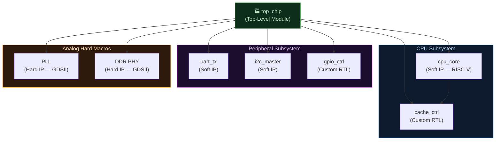

# Module 5: The Anatomy of a Verilog Module & Instantiation

> **Repository:** VLSI & Digital Design — Interview Preparation & Conceptual Reference  
> **Author:** Shravana HS  
> **Standard:** IEEE 1364-2005 / IEEE 1800-2017 (SystemVerilog)  
> **Status:** 🟢 Active — Last Reviewed April 2026

---

## Table of Contents

1. [Comments in Verilog](#1-comments-in-verilog)
2. [The Verilog Module — Fundamental Unit of Hardware](#2-the-verilog-module--fundamental-unit-of-hardware)
3. [ANSI-Style Module Declaration](#3-ansi-style-module-declaration)
4. [Module Instantiation — Positional vs. Named Mapping](#4-module-instantiation--positional-vs-named-mapping)
5. [The Hierarchy Principle](#5-the-hierarchy-principle)
6. [Summary Cheat Sheet](#summary-cheat-sheet)

---

## 1. Comments in Verilog

Verilog supports two styles of comments, both functionally identical but with a critical behavioral difference that regularly traps engineers.

### 1.1 Single-Line Comment (`//`)

A `//` comment extends from the double-slash to the end of the current line. It is safe to nest and universally preferred for in-code annotation.

```verilog
assign sum = a ^ b ^ cin;  // XOR chain — Sum output of full adder
```

### 1.2 Block Comment (`/* ... */`)

A block comment spans multiple lines. It begins with `/*` and ends with the first `*/` encountered — and this is where the danger lies.

```verilog
/* This is a valid block comment.
   It can span many lines. */
assign cout = (a & b) | (b & cin) | (a & cin);
```

> **🔥 Interview Trap**
>
> **Q: What happens if you use `/* ... */` to comment out a region of code that already contains a block comment?**
>
> **The result is a catastrophic, non-obvious syntax error.** Block comments in Verilog (and C) **do NOT nest**.
>
> ```verilog
> /* Attempting to comment out this block:
>
>    wire temp;
>    /* This was an old block comment inside */   ← THIS terminates the OUTER comment
>    assign out = temp & en;
>
> */  ← This is now dangling — the parser sees it as an error
> ```
>
> The first `*/` encountered closes the outer `/*`, leaving `assign out = temp & en;` as live, unexpectedly active code. The trailing `*/` is then a syntax error (unexpected closing comment token with no matching open).
>
> **Industry Rule:** Always use single-line `//` comments when commenting out blocks of code. Most IDEs provide a "toggle line comment" shortcut (`Ctrl+/`) precisely for this purpose. Block comments are for header banners and function/module documentation only.

---

## 2. The Verilog Module — Fundamental Unit of Hardware

In Verilog, a **module** is the fundamental unit of design. It is the direct hardware analog of:
- A **chip** at the top level
- A **functional block** (e.g., ALU, Register File, UART Controller) at an intermediate level
- A **primitive gate** at the leaf level

Every module defines:
- **Its interface:** The ports (inputs and outputs) — the wires entering and leaving the block.
- **Its behavior:** The RTL code describing what the block computes (behavioral, dataflow, or structural).

```verilog
// A module is a self-contained hardware description.
// It NEVER has a "main()" — hardware doesn't start or stop.
// All modules exist concurrently in a real chip.
module module_name (
    // Port list
);
    // Internal declarations and logic
endmodule
```

---

## 3. ANSI-Style Module Declaration

The IEEE 1364-2001 (Verilog-2001) standard introduced **ANSI-style port declarations** — the modern, industry-standard format where ports are declared directly in the module header instead of separately in the body. It is cleaner, less error-prone, and universally expected in modern RTL.

### Example: N-bit Synchronous Accumulator

```verilog
// ============================================================
// N-BIT SYNCHRONOUS ACCUMULATOR — ANSI-Style Module Declaration
//
// Key features of ANSI style:
//  1. Port type (input/output) declared IN the port list header.
//  2. Parameter declared in the port list using #(...) syntax.
//  3. No separate port direction declarations needed in the body.
//  4. Synthesizable — all constructs map to real hardware.
// ============================================================
module accumulator #(
    parameter DATA_WIDTH = 8    // Parameterized bit width — set by the instantiating module
)(
    // --- Clock & Reset ---
    input  wire                   clk,     // Rising-edge active system clock
    input  wire                   rst_n,   // Active-LOW synchronous reset (industry standard)

    // --- Data Inputs ---
    input  wire                   load,    // Load: replace accumulator content with data_in
    input  wire                   accum_en,// Accumulate enable: add data_in to current value
    input  wire [DATA_WIDTH-1:0]  data_in, // Input operand (DATA_WIDTH bits wide)

    // --- Data Outputs ---
    output reg  [DATA_WIDTH-1:0]  accum_out,       // Accumulator register — using reg, maps to DFF
    output wire                   overflow         // Overflow flag: 1 if result exceeds DATA_WIDTH
);

    // -------------------------------------------------------
    // Internal Signal: Carry bit from addition
    // -------------------------------------------------------
    wire [DATA_WIDTH:0] sum_extended;  // One extra bit to capture overflow

    // Combinational adder — continuously computes
    assign sum_extended = {1'b0, accum_out} + {1'b0, data_in};
    assign overflow     = sum_extended[DATA_WIDTH]; // MSB is the carry/overflow

    // -------------------------------------------------------
    // Sequential Logic — The accumulator register
    // Always @(posedge clk) → synthesizes to a bank of D Flip-Flops
    // -------------------------------------------------------
    always @(posedge clk) begin
        if (!rst_n) begin
            accum_out <= {DATA_WIDTH{1'b0}};  // Synchronous reset: flush to 0
        end else if (load) begin
            accum_out <= data_in;             // Load mode: capture new data directly
        end else if (accum_en) begin
            accum_out <= sum_extended[DATA_WIDTH-1:0]; // Accumulate: add and store
        end
        // Implicit: if no enable, hold state (DFF holds)
    end

endmodule
```

### Key ANSI Declaration Features Explained

| Feature | Old Verilog-1995 Style | Modern ANSI Verilog-2001 Style |
|:---|:---|:---|
| **Port Direction** | Declared separately inside module body | Declared inline in the port list header |
| **Parameters** | `parameter` inside module body | `#(parameter ...)` in the module header |
| **Readability** | Low — direction and type split across file | High — full port spec visible in one block |
| **Error Risk** | High — port count mismatch between header and body | Low — single source of truth |
| **Industry Usage** | Legacy code only | **Standard in all modern RTL** |

---

## 4. Module Instantiation — Positional vs. Named Mapping

When you instantiate a module (use it inside another module), you must connect your signals to its ports. There are two syntaxes — one safe, one dangerous.

### 4.1 Positional Mapping (Port Order-Dependent)

In positional mapping, signals are connected to ports in the exact order they appear in the module definition. There are no port names visible at the instantiation site.

```verilog
// Module definition (somewhere in your codebase):
module fulladder (
    input  wire a,
    input  wire b,
    input  wire cin,
    output wire sum,
    output wire cout
);
// ...
endmodule

// ============================================================
// POSITIONAL INSTANTIATION — DANGEROUS IN PRODUCTION
// The connection is purely order-dependent:
// Position 1 → a, Position 2 → b, Position 3 → cin, etc.
// ============================================================
module top_positional;
    wire A, B, Cin, Sum, Cout;

    // Connecting by POSITION — a=A, b=B, cin=Cin, sum=Sum, cout=Cout
    // IF the port order in fulladder ever changes, THIS IS SILENT AND WRONG.
    fulladder FA0 (A, B, Cin, Sum, Cout);

endmodule
```

### 4.2 Named Mapping (`.port(signal)`) — The Industry Standard

In named mapping, each port is connected explicitly by name using the `.port_name(signal_name)` syntax. Order is irrelevant — correctness is guaranteed by name resolution.

```verilog
// ============================================================
// NAMED PORT INSTANTIATION — THE ONLY ACCEPTABLE STYLE
// Each connection is explicit: .module_port(your_signal)
// ============================================================
module top_named;
    wire A, B, Cin, Sum, Cout;

    fulladder FA0 (
        .a   (A),    // Module port 'a'   ← driven by signal 'A'
        .b   (B),    // Module port 'b'   ← driven by signal 'B'
        .cin (Cin),  // Module port 'cin' ← driven by signal 'Cin'
        .sum (Sum),  // Module port 'sum' → drives signal 'Sum'
        .cout(Cout)  // Module port 'cout'→ drives signal 'Cout'
    );

endmodule
```

> **🔥 Interview Trap**
>
> **Q: Why is positional port mapping considered dangerous in industrial RTL? What specific failure mode does it cause?**
>
> **The failure is silent and synthesis will not catch it.** Consider:
>
> ```verilog
> // Original port order:
> module uart_tx (input clk, input rst_n, input [7:0] data, output tx_out);
>
> // instantiation with positional mapping:
> uart_tx U0 (sys_clk, n_reset, tx_data, serial_out);  // Correct today
> ```
>
> Now suppose a junior engineer modifies the `uart_tx` module to add an enable signal at position 3:
>
> ```verilog
> // MODIFIED port order:
> module uart_tx (input clk, input rst_n, input tx_en, input [7:0] data, output tx_out);
> ```
>
> The positional instantiation silently becomes:
> ```
> clk   = sys_clk   ✅
> rst_n = n_reset   ✅
> tx_en = tx_data   ❌ (8-bit data driving 1-bit enable!)
> data  = serial_out ❌ (output driving input — possible contention!)
> tx_out = ...      unconnected!
> ```
>
> **The synthesizer and linter may not flag this.** The design will compile and potentially even simulate with warnings, leading to a silicon bug that costs months of re-spin time.
>
> **Named mapping is 100% immune to port reordering** — the compiler resolves by name, not position. All professional RTL coding standards (Google's RTL Style Guide, lowRISC Coding Style, ARM IHI0011) mandate named port connections. No exceptions.

---

## 5. The Hierarchy Principle

Verilog designs are hierarchical — modules instantiate other modules, forming a tree. The top-level module (often called `top`, `soc_top`, or `chip_top`) is the root. This hierarchy maps directly to physical layout: each module becomes a placed block in the chip floorplan.



---

## Summary Cheat Sheet

| Concept | Key Rule |
|:---|:---|
| **Single-line comment** (`//`) | Safe everywhere; terminates at line end. |
| **Block comment** (`/* */`) | Does NOT nest — never use to comment out code containing other block comments. |
| **ANSI module declaration** | Declare port direction inline in the `#()/()` header. Industry standard since Verilog-2001. |
| **Positional instantiation** | Order-dependent, silently breaks on port list changes. **Forbidden in production RTL.** |
| **Named instantiation** (`.port(signal)`) | Name-resolved, refactor-safe. **The only acceptable industrial style.** |
| **Module hierarchy** | Modules form a tree. The floorplan mirrors this hierarchy. |

---

*Module 6 → Keywords & Verification Fundamentals*
