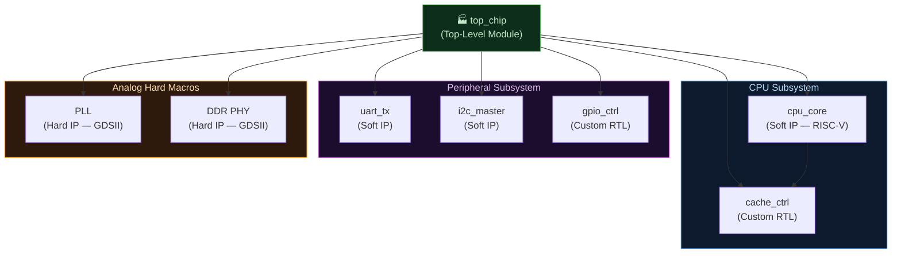
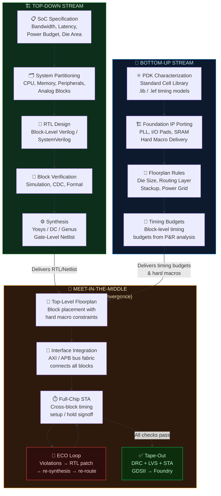

# Module 5: Verilog Fundamentals — Module Anatomy, Keywords, Verification & Synthesis

> **Repository:** VLSI & Digital Design — Interview Preparation & Conceptual Reference  
> **Author:** Shravana HS  
> **Standard:** IEEE 1364-2005 / IEEE 1800-2017 (SystemVerilog) / Synopsys DC / Cadence Genus  
> **Status:** 🟢 Active — Last Reviewed April 2026

---

## Table of Contents

### Part A — Module Anatomy & Instantiation
1. [Comments in Verilog](#1-comments-in-verilog)
2. [The Verilog Module — Fundamental Unit of Hardware](#2-the-verilog-module--fundamental-unit-of-hardware)
3. [ANSI-Style Module Declaration](#3-ansi-style-module-declaration)
4. [Module Instantiation — Positional vs. Named Mapping](#4-module-instantiation--positional-vs-named-mapping)
5. [The Hierarchy Principle](#5-the-hierarchy-principle)

### Part B — Keywords & Verification Fundamentals
6. [Verilog Keywords — The Reserved Vocabulary](#6-verilog-keywords--the-reserved-vocabulary)
7. [The Simulation Engine — How Verilog Actually Runs](#7-the-simulation-engine--how-verilog-actually-runs)
8. [Abstract Time: The `#delay` Construct](#8-abstract-time-the-delay-construct)
9. [The Testbench — A Closed Simulation Universe](#9-the-testbench--a-closed-simulation-universe)
10. [The `initial` Block — Simulation-Only Stimulus](#10-the-initial-block--simulation-only-stimulus)
11. [Testbench Anatomy — Complete Example](#11-testbench-anatomy--complete-example)

### Part C — Design Methodologies & Advanced Synthesis
12. [Synthesis — From RTL Intent to Physical Gates](#12-synthesis--from-rtl-intent-to-physical-gates)
13. [The Three Phases of Synthesis](#13-the-three-phases-of-synthesis)
14. [Design Methodologies](#14-design-methodologies)
15. [Top-Down Approach](#15-top-down-approach)
16. [Bottom-Up Approach](#16-bottom-up-approach)
17. [Meet-in-the-Middle — The Real-World Standard](#17-meet-in-the-middle--the-real-world-standard)
18. [Methodology Comparison Diagram](#18-methodology-comparison-diagram)
19. [Timing Constraints & SDC — Directing Synthesis](#19-timing-constraints--sdc--directing-synthesis)
20. [Summary Cheat Sheet](#summary-cheat-sheet)

---

# Part A — Module Anatomy & Instantiation

---

## 1. Comments in Verilog

Verilog supports two styles of comments, both functionally identical but with a critical behavioral difference that regularly traps engineers.

### 1.1 Single-Line Comment (`//`)

A `//` comment extends from the double-slash to the end of the current line. It is safe to nest and universally preferred for in-code annotation.

```verilog
assign sum = a ^ b ^ cin;  // XOR chain — Sum output of full adder
```

### 1.2 Block Comment (`/* ... */`)

A block comment spans multiple lines. It begins with `/*` and ends with the first `*/` encountered — and this is where the danger lies.

```verilog
/* This is a valid block comment.
   It can span many lines. */
assign cout = (a & b) | (b & cin) | (a & cin);
```

> **🔥 Interview Trap**
>
> **Q: What happens if you use `/* ... */` to comment out a region of code that already contains a block comment?**
>
> **The result is a catastrophic, non-obvious syntax error.** Block comments in Verilog (and C) **do NOT nest**.
>
> ```verilog
> /* Attempting to comment out this block:
>
>    wire temp;
>    /* This was an old block comment inside */   ← THIS terminates the OUTER comment
>    assign out = temp & en;
>
> */  ← This is now dangling — the parser sees it as an error
> ```
>
> The first `*/` encountered closes the outer `/*`, leaving `assign out = temp & en;` as live, unexpectedly active code. The trailing `*/` is then a syntax error.
>
> **Industry Rule:** Always use single-line `//` comments when commenting out blocks of code. Most IDEs provide a "toggle line comment" shortcut (`Ctrl+/`) precisely for this purpose. Block comments are for header banners and function/module documentation only.

---

## 2. The Verilog Module — Fundamental Unit of Hardware

In Verilog, a **module** is the fundamental unit of design. It is the direct hardware analog of:
- A **chip** at the top level
- A **functional block** (e.g., ALU, Register File, UART Controller) at an intermediate level
- A **primitive gate** at the leaf level

Every module defines:
- **Its interface:** The ports (inputs and outputs) — the wires entering and leaving the block.
- **Its behavior:** The RTL code describing what the block computes (behavioral, dataflow, or structural).

```verilog
// A module is a self-contained hardware description.
// It NEVER has a "main()" — hardware doesn't start or stop.
// All modules exist concurrently in a real chip.
module module_name (
    // Port list
);
    // Internal declarations and logic
endmodule
```

---

## 3. ANSI-Style Module Declaration

The IEEE 1364-2001 (Verilog-2001) standard introduced **ANSI-style port declarations** — the modern, industry-standard format where ports are declared directly in the module header instead of separately in the body. It is cleaner, less error-prone, and universally expected in modern RTL.

### Example: N-bit Synchronous Accumulator

```verilog
// ============================================================
// N-BIT SYNCHRONOUS ACCUMULATOR — ANSI-Style Module Declaration
//
// Key features of ANSI style:
//  1. Port type (input/output) declared IN the port list header.
//  2. Parameter declared in the port list using #(...) syntax.
//  3. No separate port direction declarations needed in the body.
//  4. Synthesizable — all constructs map to real hardware.
// ============================================================
module accumulator #(
    parameter DATA_WIDTH = 8    // Parameterized bit width — set by the instantiating module
)(
    // --- Clock & Reset ---
    input  wire                   clk,     // Rising-edge active system clock
    input  wire                   rst_n,   // Active-LOW synchronous reset (industry standard)

    // --- Data Inputs ---
    input  wire                   load,    // Load: replace accumulator content with data_in
    input  wire                   accum_en,// Accumulate enable: add data_in to current value
    input  wire [DATA_WIDTH-1:0]  data_in, // Input operand (DATA_WIDTH bits wide)

    // --- Data Outputs ---
    output reg  [DATA_WIDTH-1:0]  accum_out,       // Accumulator register — using reg, maps to DFF
    output wire                   overflow         // Overflow flag: 1 if result exceeds DATA_WIDTH
);

    // -------------------------------------------------------
    // Internal Signal: Carry bit from addition
    // -------------------------------------------------------
    wire [DATA_WIDTH:0] sum_extended;  // One extra bit to capture overflow

    // Combinational adder — continuously computes
    assign sum_extended = {1'b0, accum_out} + {1'b0, data_in};
    assign overflow     = sum_extended[DATA_WIDTH]; // MSB is the carry/overflow

    // -------------------------------------------------------
    // Sequential Logic — The accumulator register
    // Always @(posedge clk) → synthesizes to a bank of D Flip-Flops
    // -------------------------------------------------------
    always @(posedge clk) begin
        if (!rst_n) begin
            accum_out <= {DATA_WIDTH{1'b0}};  // Synchronous reset: flush to 0
        end else if (load) begin
            accum_out <= data_in;             // Load mode: capture new data directly
        end else if (accum_en) begin
            accum_out <= sum_extended[DATA_WIDTH-1:0]; // Accumulate: add and store
        end
        // Implicit: if no enable, hold state (DFF holds)
    end

endmodule
```

### Key ANSI Declaration Features Explained

| Feature | Old Verilog-1995 Style | Modern ANSI Verilog-2001 Style |
|:---|:---|:---|
| **Port Direction** | Declared separately inside module body | Declared inline in the port list header |
| **Parameters** | `parameter` inside module body | `#(parameter ...)` in the module header |
| **Readability** | Low — direction and type split across file | High — full port spec visible in one block |
| **Error Risk** | High — port count mismatch between header and body | Low — single source of truth |
| **Industry Usage** | Legacy code only | **Standard in all modern RTL** |

---

## 4. Module Instantiation — Positional vs. Named Mapping

When you instantiate a module (use it inside another module), you must connect your signals to its ports. There are two syntaxes — one safe, one dangerous.

### 4.1 Positional Mapping (Port Order-Dependent)

In positional mapping, signals are connected to ports in the exact order they appear in the module definition. There are no port names visible at the instantiation site.

```verilog
// Module definition (somewhere in your codebase):
module fulladder (
    input  wire a,
    input  wire b,
    input  wire cin,
    output wire sum,
    output wire cout
);
// ...
endmodule

// ============================================================
// POSITIONAL INSTANTIATION — DANGEROUS IN PRODUCTION
// The connection is purely order-dependent:
// Position 1 → a, Position 2 → b, Position 3 → cin, etc.
// ============================================================
module top_positional;
    wire A, B, Cin, Sum, Cout;

    // Connecting by POSITION — a=A, b=B, cin=Cin, sum=Sum, cout=Cout
    // IF the port order in fulladder ever changes, THIS IS SILENT AND WRONG.
    fulladder FA0 (A, B, Cin, Sum, Cout);

endmodule
```

### 4.2 Named Mapping (`.port(signal)`) — The Industry Standard

In named mapping, each port is connected explicitly by name using the `.port_name(signal_name)` syntax. Order is irrelevant — correctness is guaranteed by name resolution.

```verilog
// ============================================================
// NAMED PORT INSTANTIATION — THE ONLY ACCEPTABLE STYLE
// Each connection is explicit: .module_port(your_signal)
// ============================================================
module top_named;
    wire A, B, Cin, Sum, Cout;

    fulladder FA0 (
        .a   (A),    // Module port 'a'   ← driven by signal 'A'
        .b   (B),    // Module port 'b'   ← driven by signal 'B'
        .cin (Cin),  // Module port 'cin' ← driven by signal 'Cin'
        .sum (Sum),  // Module port 'sum' → drives signal 'Sum'
        .cout(Cout)  // Module port 'cout'→ drives signal 'Cout'
    );

endmodule
```

> **🔥 Interview Trap**
>
> **Q: Why is positional port mapping considered dangerous in industrial RTL? What specific failure mode does it cause?**
>
> **The failure is silent and synthesis will not catch it.** Consider:
>
> ```verilog
> // Original port order:
> module uart_tx (input clk, input rst_n, input [7:0] data, output tx_out);
>
> // instantiation with positional mapping:
> uart_tx U0 (sys_clk, n_reset, tx_data, serial_out);  // Correct today
> ```
>
> Now suppose a junior engineer modifies the `uart_tx` module to add an enable signal at position 3:
>
> ```verilog
> // MODIFIED port order:
> module uart_tx (input clk, input rst_n, input tx_en, input [7:0] data, output tx_out);
> ```
>
> The positional instantiation silently becomes:
> ```
> clk   = sys_clk   ✅
> rst_n = n_reset   ✅
> tx_en = tx_data   ❌ (8-bit data driving 1-bit enable!)
> data  = serial_out ❌ (output driving input — possible contention!)
> tx_out = ...      unconnected!
> ```
>
> **The synthesizer and linter may not flag this.** The design will compile and potentially even simulate with warnings, leading to a silicon bug that costs months of re-spin time.
>
> **Named mapping is 100% immune to port reordering** — the compiler resolves by name, not position. All professional RTL coding standards (Google's RTL Style Guide, lowRISC Coding Style, ARM IHI0011) mandate named port connections. No exceptions.

---

## 5. The Hierarchy Principle

Verilog designs are hierarchical — modules instantiate other modules, forming a tree. The top-level module (often called `top`, `soc_top`, or `chip_top`) is the root. This hierarchy maps directly to physical layout: each module becomes a placed block in the chip floorplan.



---

# Part B — Keywords & Verification Fundamentals

---

## 6. Verilog Keywords — The Reserved Vocabulary

Verilog defines a set of **reserved keywords** — identifiers that the language specification has pre-assigned a specific syntactic meaning. The designer cannot use them as signal names, module names, or parameter names.

**The critical rule about Verilog keywords:**

> **All Verilog keywords are strictly lowercase.**

This is a direct consequence of Verilog being a **case-sensitive language**. `wire`, `reg`, `module`, `always`, `assign`, and `if` are keywords. `Wire`, `REG`, `ALWAYS` are valid user-defined identifiers — they are not keywords and will not be treated as such by the compiler.

```verilog
// ✅ CORRECT — keyword in lowercase
wire        q_out;
reg  [7:0]  data_bus;
assign      q_out = data_in & enable;

// ✅ ALSO VALID — 'Wire' and 'Reg' are NOT keywords; they are identifiers
// (But DO NOT do this — it is confusingly bad style)
// wire Wire;  // Legal but catastrophically misleading

// Complete list of common reserved keywords (all lowercase):
// module   endmodule   input    output    inout
// wire     reg         integer  parameter localparam
// always   initial     assign   begin     end
// if       else        case     casex     casez
// endcase  for         while    repeat    forever
// posedge  negedge     and      or        not
// nand     nor         xor      xnor      buf
// #        @           $        ?         :
```

> **🔥 Interview Trap**
>
> **Q: Is Verilog case-sensitive? Give an example where this matters.**
>
> **Yes — completely and unambiguously case-sensitive.** Every identifier, keyword, and signal name is distinct based on exact character case.
>
> ```verilog
> wire reset;   // 'reset' — a signal
> wire Reset;   // 'Reset' — a DIFFERENT signal (capital R)
> wire RESET;   // 'RESET' — a THIRD, entirely separate signal
>
> // 'always' is a keyword. 'Always' is a valid (if terrible) signal name.
> // wire Always;  // Legal. The synthesizer won't confuse it with the keyword.
> ```
>
> In practice, **naming conventions prevent this chaos**: all signals are `snake_case`, parameters are `UPPER_CASE`, module names are `PascalCase` or `snake_case`. Consistent style makes case-sensitivity irrelevant as a source of bugs.

---

## 7. The Simulation Engine — How Verilog Actually Runs

Verilog simulation is executed by an **event-driven simulator**. Understanding the simulation execution model is essential for correctly writing testbenches and debugging race conditions.

### 7.1 Event-Driven Simulation

Rather than stepping through time nanosecond by nanosecond (which would be computationally wasteful during inactive periods), the simulator maintains an **event queue**:

```
Simulation Time Model:

Simulation time t₀ ──────────────────────────────────────────►
                   │         │              │
                 t=0ns     t=10ns         t=25ns
                   │         │              │
               Events:   Events:         Events:
               - rst_n=0  - rst_n=1       - data_in=8'hAB
               - clk=0   - clk=1→0       - clk posedge
                          - always block  - DFF captures data_in
                            triggers
```

**The simulation loop:**
1. Pick the lowest-time event from the queue.
2. Advance simulation time to that event's timestamp.
3. Execute all processes triggered by that event (update signals, evaluate `always` blocks).
4. If those updates generate new events, enqueue them for the same or future time.
5. If the queue is empty at the current time, advance to the next populated time slot.
6. Repeat until `$finish` or simulation end.

### 7.2 The Verilog Scheduling Regions

Within a single simulation time step, Verilog defines multiple **scheduling regions** to resolve ordering:

```
Single Simulation Time Step (e.g., t = 10ns):
┌──────────────────────────────────────────────────────────────┐
│  1. Active Region                                            │
│     → Non-blocking RHS evaluated, blocking assignments exec  │
│     → assign statements re-evaluated                         │
│                                                              │
│  2. NBA Region (Non-Blocking Assignment Update)              │
│     → Non-blocking LHS updated (<=)                          │
│     → This is WHY non-blocking assignments model DFF behavior│
│                                                              │
│  3. Postponed Region                                         │
│     → $monitor, $strobe execute — observe stable final values│
└──────────────────────────────────────────────────────────────┘
```

This scheduling model is exactly why `<=` (non-blocking) is mandatory for sequential logic — it separates the RHS read from the LHS write, preventing the "write before neighbor reads" race condition that `=` (blocking) causes in `always @(posedge clk)` blocks.

---

## 8. Abstract Time: The `#delay` Construct

Verilog's `#N` construct specifies an **abstract time unit** — a pure simulation delay with no physical meaning. The `timescale` directive maps this to real time solely for waveform display purposes.

```verilog
`timescale 1ns / 1ps
// 1ns = time unit (what #1 means)
// 1ps = time precision (resolution of simulation timestamps)

initial begin
    #10;       // Wait 10 × 1ns = 10ns of simulation time
    a = 1'b1;  // Change signal 'a' after 10ns
    #5;        // Wait 5 more ns
    b = 1'b0;
end
```

> **🔥 Interview Trap**
>
> **Q: If I write `assign #5 out = in;` in my RTL, what happens after synthesis?**
>
> **The `#5` is completely and silently ignored by every synthesis tool.** Timing delays specified with `#` in RTL are purely simulation artifacts. The synthesizer discards them because:
>
> 1. **Real propagation delays are determined by the physical standard cells** chosen during synthesis, characterized in the `.lib` timing model — not by the RTL designer's arbitrary `#5`.
> 2. **The foundry's silicon process determines timing**, not the Verilog source code.
>
> Writing `assign #5 out = in;` does not give you a 5ns delay in silicon. It gives you the delay of whatever gate the synthesizer maps `assign out = in` to — typically a buffer with ~0.1–0.5ns delay.
>
> **The correct way to constrain timing** in synthesis is through SDC (Synopsys Design Constraints) files:
> ```tcl
> # SDC — the real way to specify timing requirements
> create_clock -name sys_clk -period 10.0 [get_ports clk] ; # 10ns period = 100MHz
> set_input_delay  2.0 -clock sys_clk [get_ports data_in]
> set_output_delay 1.5 -clock sys_clk [get_ports data_out]
> ```

---

## 9. The Testbench — A Closed Simulation Universe

A **testbench** is a special Verilog module that exists purely within the simulation environment. It has no synthesis-equivalent hardware reality — it is the simulation wrapper that exercises your Design Under Test (DUT).

### Testbench Defining Characteristics

| Property | Testbench | Synthesizable RTL Module |
|:---|:---|:---|
| **Port List** | **None — no ports whatsoever** | Has input/output/inout ports |
| **DUT Inputs** | Declared as `reg` (testbench drives them) | Declared as `input wire` |
| **DUT Outputs** | Declared as `wire` (testbench observes them) | Declared as `output reg/wire` |
| **Stimulus Method** | `initial` blocks (run once, simulation-only) | `always` blocks (run forever, synthesizable) |
| **Time Control** | `#delay`, `@(event)`, `wait()` — all ignored by synth | None (no simulation delays in RTL) |
| **Clock Generation** | `always #5 clk = ~clk;` (toggle every 5 time units) | Clock is an `input wire`, driven externally |
| **Synthesized?** | **Never** | Yes — maps to gates/flip-flops |

### Why DUT Inputs are `reg` in the Testbench

In a testbench, the signals connected to the DUT's input ports are driven by the testbench's `initial` block — a procedural context. In Verilog, **only `reg` types can be driven from procedural blocks** (`initial`, `always`). Therefore, every signal the testbench drives into the DUT must be declared `reg`.

Conversely, the DUT's output signals are received (observed) by the testbench, not driven. They must be `wire` — they are continuously assigned by the DUT's internal logic.

```
Testbench Signal Declarations:
  reg  a_tb, b_tb, cin_tb;    ← Testbench DRIVES these → DUT inputs
  wire sum_tb, cout_tb;       ← DUT DRIVES these → Testbench observes
```

---

## 10. The `initial` Block — Simulation-Only Stimulus

The `initial` block is syntactically similar to `always` but executes exactly **once**, starting at time `t = 0` and running to completion (or until `$finish`). It has no hardware equivalent — it does not map to any repeating real-world process. It is the primary tool for providing testbench stimulus.

```verilog
initial begin
    // t=0: Initialize all DUT inputs to known state
    {a_tb, b_tb, cin_tb} = 3'b000;

    // t=0 → t=10ns: Wait, then apply first test vector
    #10;
    {a_tb, b_tb, cin_tb} = 3'b011;   // Expect: Sum=1, Cout=1

    // t=10ns → t=20ns: Wait, apply next vector
    #10;
    {a_tb, b_tb, cin_tb} = 3'b111;   // Expect: Sum=1, Cout=1

    #10;
    $finish;   // Terminate simulation — no equivalent in hardware
end
```

> **🔥 Interview Trap**
>
> **Q: Can an `initial` block be synthesized? Why or why not?**
>
> **No — `initial` blocks are not synthesizable** (with one narrow exception for FPGA BRAM initialization).
>
> The reason is fundamental: an `initial` block describes **a one-shot sequential process that starts at time zero**. In real hardware, there is no concept of "time zero" or "running once at power-up and stopping." Hardware is a network of continuously active elements — flip-flops hold state via feedback, combinational gates continuously evaluate inputs.
>
> **The exception:** Some FPGA synthesis tools (Xilinx Vivado, Intel Quartus) allow `initial` blocks inside `always @*` or in specific register declarations to set power-up initial values for Block RAMs and distributed LUTs. But this is an FPGA-specific vendor extension — not general synthesizability. In ASIC flows (the domain of Synopsys DC, Cadence Genus), `initial` blocks are ignored entirely.
>
> **For ASIC design:** Power-up state is controlled by reset logic (`rst_n`), not `initial` blocks.

---

## 11. Testbench Anatomy — Complete Example

```verilog
// ============================================================
// TESTBENCH: Parameterized N-Bit Adder
// File: adder_tb.v
//
// Demonstrates all testbench conventions:
//  - No port list (closed universe)
//  - reg for DUT inputs, wire for DUT outputs
//  - initial block for one-shot stimulus
//  - always block for clock generation
//  - $dumpfile/$dumpvars for GTKWave waveform capture
//  - Self-checking with $error assertions
// ============================================================
`timescale 1ns / 1ps

module adder_tb;   // ← No port list — a testbench has ZERO ports

    // -------------------------------------------------------
    // Parameters — must match DUT parameters
    // -------------------------------------------------------
    localparam DATA_W = 8;

    // -------------------------------------------------------
    // Signal declarations
    // DUT inputs → reg (driven by initial block)
    // DUT outputs → wire (driven by DUT, observed by TB)
    // -------------------------------------------------------
    reg                   clk_tb;    // System clock
    reg                   rst_n_tb;  // Active-low reset
    reg  [DATA_W-1:0]     a_tb;      // Operand A
    reg  [DATA_W-1:0]     b_tb;      // Operand B
    wire [DATA_W:0]       sum_tb;    // Sum (N+1 bits to capture carry)

    // -------------------------------------------------------
    // DUT Instantiation — ALWAYS use named port mapping
    // -------------------------------------------------------
    ripple_adder #(.DATA_WIDTH(DATA_W)) DUT (
        .clk   (clk_tb),
        .rst_n (rst_n_tb),
        .a     (a_tb),
        .b     (b_tb),
        .sum   (sum_tb)
    );

    // -------------------------------------------------------
    // Clock Generation — 10ns period (100 MHz)
    // -------------------------------------------------------
    initial clk_tb = 1'b0;
    always #5 clk_tb = ~clk_tb;    // Toggle every 5ns → 10ns period

    // -------------------------------------------------------
    // Waveform Capture — for GTKWave post-simulation viewing
    // -------------------------------------------------------
    initial begin
        $dumpfile("adder_dump.vcd");
        $dumpvars(0, adder_tb);   // Dump all signals in this scope
    end

    // -------------------------------------------------------
    // Stimulus & Self-Checking — one-shot initial block
    // -------------------------------------------------------
    task apply_and_check;
        input [DATA_W-1:0] a_in, b_in;
        input [DATA_W:0]   expected_sum;
        begin
            a_tb = a_in;
            b_tb = b_in;
            @(posedge clk_tb);    // Synchronize to clock edge
            #1;                   // Small delay to let outputs settle
            if (sum_tb !== expected_sum) begin
                $error("FAIL: a=%0d b=%0d | Got=%0d Expected=%0d",
                        a_in, b_in, sum_tb, expected_sum);
            end else begin
                $display("PASS: a=%0d b=%0d | sum=%0d", a_in, b_in, sum_tb);
            end
        end
    endtask

    initial begin
        // --- Reset sequence ---
        rst_n_tb = 1'b0;
        a_tb     = '0;
        b_tb     = '0;
        @(posedge clk_tb); @(posedge clk_tb);  // Hold reset 2 cycles
        rst_n_tb = 1'b1;

        // --- Test vectors ---
        apply_and_check(8'd0,   8'd0,   9'd0);
        apply_and_check(8'd127, 8'd1,   9'd128);
        apply_and_check(8'd255, 8'd1,   9'd256);   // Overflow case
        apply_and_check(8'd200, 8'd100, 9'd300);

        $display("==============================");
        $display("  Simulation Complete.");
        $display("==============================");
        $finish;
    end

endmodule
```

---

# Part C — Design Methodologies & Advanced Synthesis

---

## 12. Synthesis — From RTL Intent to Physical Gates

**Synthesis** is the automated process of transforming an RTL description (behavioral intent expressed in Verilog/SystemVerilog) into a **gate-level netlist** — a graph of interconnected, technology-specific standard cells from a PDK library.

The synthesis tool is not magic — it is a constrained optimization engine. You provide:
- **RTL source** (what you want the design to *do*)
- **SDC constraints** (what timing, area, and power targets the design must *meet*)
- **Technology library** (what physical cells are *available* from the foundry)

And it produces:
- **Gate-level netlist** (a concrete implementation satisfying — or attempting to satisfy — the constraints)

---

## 13. The Three Phases of Synthesis

Modern synthesis tools (Synopsys Design Compiler, Cadence Genus) execute synthesis in three conceptually distinct phases:

### 13.1 Phase 1: Translation (RTL → Generic Boolean Logic)

The synthesis tool reads the RTL Verilog and translates it into a **technology-independent intermediate representation** — a graph of generic Boolean operations (AND, OR, XOR, NOT, MUX, registers).

At this stage:
- `assign out = a & b;` → Generic AND gate
- `always @(posedge clk)` → Generic D Flip-Flop
- `if/case` statements → Generic MUX trees
- Parameters are resolved to constants

**The tool has NOT yet decided which specific standard cells will be used.** This phase is purely about faithfully representing the RTL's logical intent.

```verilog
// RTL Input to Synthesis:
module priority_enc (
    input  wire [3:0] req,
    output reg  [1:0] grant
);
    always @(*) begin
        casez (req)
            4'b1???: grant = 2'd3;
            4'b01??: grant = 2'd2;
            4'b001?: grant = 2'd1;
            default: grant = 2'd0;
        endcase
    end
endmodule

// Translation output (conceptual — technology-independent):
// A priority MUX tree with 4 levels of selection logic.
// No specific cell names yet.
```

### 13.2 Phase 2: Logic Optimization (The Ruthless Simplifier)

This is the most powerful phase. The synthesis tool applies a battery of **Boolean algebra transformations** to minimize the logic without changing its functional behavior:

| Optimization Technique | What it Does | Example |
|:---|:---|:---|
| **Constant Propagation** | Replaces expressions whose values are constant with their result | `a & 1'b1` → `a` |
| **Dead Code Elimination** | Removes logic whose output is never used | Unused signal computation dropped |
| **Common Subexpression Elimination (CSE)** | Shares logic blocks that compute identical expressions | `(a & b)` computed once, wired to two consumers |
| **Boolean Simplification (ABC)** | Applies Karnaugh map / ROBDD minimization | 4-input expression reduced to 2-input |
| **Retiming** | Moves registers across combinational logic to balance delays | Pipeline stage alignment |
| **Resource Sharing** | Maps two multipliers to one hardware multiplier with MUX | Reduces area at cost of timing |

> **🔥 Interview Trap**
>
> **Q: I wrote a beautiful, modular RTL design with many intermediate signals for readability. Will the synthesizer preserve my signal names and circuit structure?**
>
> **No — and this is intentional.** The synthesizer's optimization engine treats your RTL as a specification of *behavior*, not as a implementation blueprint. It is completely within the synthesizer's purview to:
>
> - **Delete intermediate signals** that it determines are redundant
> - **Rearrange logic** — a 4-level XOR tree may become a 2-level circuit through Boolean optimization
> - **Merge modules** — two separately coded modules may become a single fused gate network
> - **Duplicate logic** — to reduce fanout load on timing-critical nets, the tool may clone logic gates
>
> This is a feature, not a bug. Your job is to write correct, synthesizable RTL; the synthesizer's job is to make it efficient.

### 13.3 Phase 3: Technology Mapping (Generic → PDK Standard Cells)

The optimized generic Boolean graph is now mapped onto the **target technology library** — the actual standard cells available in the chosen PDK.

The mapper:
1. Reads the `.lib` file (Liberty format) characterizing every cell's: function, drive strength, timing arcs, power, and area.
2. Uses a pattern-matching or dynamic programming algorithm to cover the Boolean graph with cell patterns.
3. Selects the cell that best satisfies the current optimization objective (minimize area, meet timing, minimize power).

```
Technology Mapping Example:

Generic Boolean:   AND(XOR(a, b), c)

Available cells in sky130_fd_sc_hd:
  sky130_fd_sc_hd__xor2_1   : 2-input XOR, delay=0.35ns, area=6.3µm²
  sky130_fd_sc_hd__and2_1   : 2-input AND, delay=0.20ns, area=3.8µm²
  sky130_fd_sc_hd__aoi21_1  : AND-OR-INVERT (AOI21), delay=0.25ns, area=4.6µm²

Mapper decision (timing-optimized):
  → Use XOR2_1 for XOR operation → then AND2_1
  → Total: 2 cells, delay = 0.55ns, area = 10.1µm²
```

---

## 14. Design Methodologies

The design methodology defines the **workflow and abstraction hierarchy** used to partition, design, and integrate a complex system. Two classical methodologies are taught in academia; the real industry practice is a hybrid.

---

## 15. Top-Down Approach

In the **Top-Down approach**, the design starts at the highest level of system abstraction — the complete SoC specification — and is progressively decomposed into smaller, more concrete blocks until the leaf-level standard cells are reached.

```
SoC Specification (System Level)
      ↓ Partition
CPU Subsystem | Memory Controller | Peripheral Bus
      ↓ RTL Design
RTL Verilog for each Subsystem Block
      ↓ Synthesis
Gate-Level Netlist (standard cell mapping)
      ↓ Place & Route
GDSII Layout
```

**Key Characteristics:**
- Architecture-driven: system requirements determine block boundaries.
- All interfaces are defined top-down — sub-blocks are designed to fit.
- Typically used by large companies designing full custom SoCs.
- **Risk:** If deeper analysis reveals the top-level partition was wrong, rework is expensive.

**Common in:** Google TPU design, Apple Silicon architecture teams, Qualcomm SoC teams.

---

## 16. Bottom-Up Approach

In the **Bottom-Up approach**, the design starts from the lowest physical level — individual transistors and standard cells — and complex functionality is assembled by progressively combining primitives into larger blocks.

```
Transistor-Level Characterization (PDK standard cells)
      ↑ Combine
Basic Gates (AND, OR, XOR, DFF) — from cell library
      ↑ Combine
Functional Units (adder, comparator, register) — custom RTL
      ↑ Combine
Subsystems (ALU, register file, data path)
      ↑ Combine
Full System (SoC)
```

**Key Characteristics:**
- Implementation-driven: physical constraints and cell characteristics determine design choices.
- Deep understanding of timing, area, and power of each primitive.
- Typical in analog and custom digital design where transistor-level knowledge is critical.
- **Risk:** Without system-level guidance, integration of bottom-up blocks may not meet architectural specs.

**Common in:** Analog IP design (PLLs, ADCs), custom standard cell library development, SRAM bit cell design.

---

## 17. Meet-in-the-Middle — The Real-World Standard

> **🔥 Interview Trap**
>
> **Q: In real SoC projects, do teams use purely Top-Down or purely Bottom-Up design methodologies?**
>
> **Neither — and claiming otherwise in an interview reveals a purely academic perspective.**
>
> The real-world standard is **Meet-in-the-Middle**, where both streams proceed simultaneously and converge at a defined integration boundary. Here's how it actually works:
>
> **Top-Down stream (Architecture Team):**
> - System architects define the SoC specification: bandwidth, latency, power budget, die area.
> - RTL teams design at the block level using standardized interfaces (AXI, APB, AHB).
> - Each block is verified against its specification independently (block-level simulation, CDC checks).
> - The top-level SoC is assembled from verified block-level netlists.
>
> **Bottom-Up stream (Physical Implementation / IP Team):**
> - Physical designers characterize available standard cell libraries (timing/power corners).
> - Foundation IPs (PLLs, I/O cells, SRAM compilers) are ported or licensed for the target node.
> - Hard macros are placed and their timing models (`.lib` abstracts) are handed upward.
> - Detailed P&R constraints (floorplan rules, routing blockages) are established empirically.
>
> **Where they meet:**
> - The RTL designer writing a block constrains their design to the timing budgets determined by the physical team's characterization data.
> - The physical team places and routes blocks whose netlists are delivered by the RTL team.
> - Integration issues discovered at P&R trigger ECOs (Engineering Change Orders) that ripple **back up** into the RTL — demonstrating that the flow is iterative, not unidirectional.
>
> **The key interview insight:** Neither Top-Down nor Bottom-Up alone works for complex SoCs because:
> - Purely Top-Down ignores physical feasibility until it's too late (timing closure failures at P&R).
> - Purely Bottom-Up has no architectural compass (you may build perfectly crafted cells that don't integrate into the required system).
>
> **Meet-in-the-Middle** is the pragmatic synthesis of both — architecture constrains implementation, implementation feeds back constraints into architecture.

---

## 18. Methodology Comparison Diagram



---

## 19. Timing Constraints & SDC — Directing Synthesis

Synthesis without constraints produces a functionally correct but timing-agnostic netlist. The **SDC (Synopsys Design Constraints)** file is the mechanism by which you direct the synthesis optimizer.

```tcl
# ============================================================
# EXAMPLE SDC — Constraining a 100MHz synchronous block
# ============================================================

# --- Clock Definition ---
# Tell the tool: there is a clock at port 'clk', with 10ns period (100MHz)
# Rise time 0ns → 1ns, Fall time 5ns → 6ns (50% duty cycle)
create_clock -name sys_clk \
             -period 10.0  \
             -waveform {0 5} \
             [get_ports clk]

# --- Input Delays ---
# Data at 'data_in' arrives 2ns after clk edge (from upstream register)
# The tool must ensure the logic from data_in to internal FFs closes in 10-2=8ns
set_input_delay 2.0 -clock sys_clk [get_ports {data_in[*] load accum_en}]

# --- Output Delays ---
# Data at 'data_out' must be stable 1.5ns before next clk edge
set_output_delay 1.5 -clock sys_clk [get_ports {data_out[*] overflow}]

# --- False Paths ---
# The reset path is asynchronous — exclude it from timing analysis
set_false_path -from [get_ports rst_n]

# --- Multicycle Paths ---
# A divide-by-2 block feeds an output that only changes every 2 cycles
set_multicycle_path 2 -setup -from [get_cells slow_path_reg*]

# --- Area / Power Directives ---
set_max_area 0            ; # Minimize area (synthesizer uses smallest cells)
set_max_fanout 16 [current_design] ; # Cap fanout at 16 loads per net
```

**The SDC-Synthesis relationship:**
- **No SDC:** Synthesis maps to minimum-area cells with no timing awareness. The result will almost certainly fail timing closure at P&R.
- **With SDC:** Synthesis targets the specified clock period, chooses faster cells for critical paths, adds buffers to reduce fanout, and generates a netlist with a statistical likelihood of meeting timing post-route.

---

## Summary Cheat Sheet

| Concept | Key Rule |
|:---|:---|
| **Single-line comment** (`//`) | Safe everywhere; terminates at line end. |
| **Block comment** (`/* */`) | Does NOT nest — never use to comment out code containing other block comments. |
| **ANSI module declaration** | Declare port direction inline in the `#()/()` header. Industry standard since Verilog-2001. |
| **Positional instantiation** | Order-dependent, silently breaks on port list changes. **Forbidden in production RTL.** |
| **Named instantiation** (`.port(signal)`) | Name-resolved, refactor-safe. **The only acceptable industrial style.** |
| **Module hierarchy** | Modules form a tree. The floorplan mirrors this hierarchy. |
| **Keywords** | All Verilog keywords are strictly lowercase. Verilog is fully case-sensitive. |
| **Event-Driven Simulation** | Simulator maintains an event queue; only processes events at active timestamps. |
| **`#delay`** | Abstract simulation time. Synthesizer ignores ALL `#` delays in RTL. Use SDC for real timing. |
| **Testbench ports** | A testbench module has **zero ports** — it is a closed system instantiating the DUT internally. |
| **DUT inputs in TB** | Declared as `reg` — driven from procedural `initial`/`always` blocks. |
| **DUT outputs in TB** | Declared as `wire` — driven by the DUT's internal logic, passively observed by the TB. |
| **`initial` block** | Executes once at t=0. **Not synthesizable** in ASIC flows. Simulation-only stimulus. |
| **Synthesis Phase 1: Translation** | RTL → Technology-independent Boolean graph. No cell names yet. |
| **Synthesis Phase 2: Optimization** | Ruthlessly eliminates redundant logic. Your signal names may disappear. Behavior is preserved. |
| **Synthesis Phase 3: Mapping** | Generic Boolean → PDK standard cells. Synopsys DC selects cells per `.lib` timing/area data. |
| **Top-Down** | System spec → RTL → Gates. Architecture-driven. Risk: physical feasibility unknown until P&R. |
| **Bottom-Up** | Transistors → Cells → Blocks → System. Implementation-driven. Risk: no architectural compass. |
| **Meet-in-the-Middle** | **The real-world standard.** Top-Down RTL meets Bottom-Up physical constraints at integration. ECOs iterate until convergence. |
| **SDC** | The mandatory timing constraint file. Without it, synthesis is untargeted. |
| **ECO** | Engineering Change Order — the inevitable RTL fix triggered by physical implementation feedback. |

---

*Module 6 → The Grammar of Silicon: Lexical Elements & Data Types*
