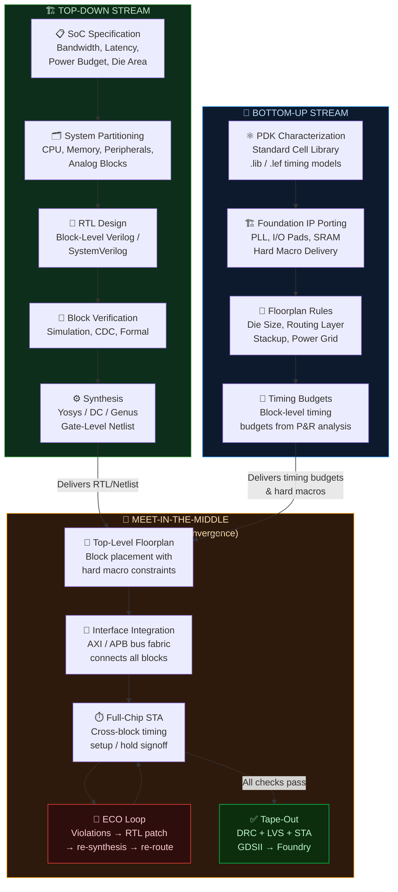

# Module 7: Design Methodologies & Advanced Synthesis

> **Repository:** VLSI & Digital Design — Interview Preparation & Conceptual Reference  
> **Author:** Shravana HS  
> **Standard:** IEEE 1364-2005 / Synopsys DC / Cadence Genus  
> **Status:** 🟢 Active — Last Reviewed April 2026

---

## Table of Contents

1. [Synthesis — From RTL Intent to Physical Gates](#1-synthesis--from-rtl-intent-to-physical-gates)
2. [The Three Phases of Synthesis](#2-the-three-phases-of-synthesis)
3. [Design Methodologies](#3-design-methodologies)
4. [Top-Down Approach](#4-top-down-approach)
5. [Bottom-Up Approach](#5-bottom-up-approach)
6. [Meet-in-the-Middle — The Real-World Standard](#6-meet-in-the-middle--the-real-world-standard)
7. [Methodology Comparison Diagram](#7-methodology-comparison-diagram)
8. [Timing Constraints & SDC — Directing Synthesis](#8-timing-constraints--sdc--directing-synthesis)
9. [Summary Cheat Sheet](#summary-cheat-sheet)

---

## 1. Synthesis — From RTL Intent to Physical Gates

**Synthesis** is the automated process of transforming an RTL description (behavioral intent expressed in Verilog/SystemVerilog) into a **gate-level netlist** — a graph of interconnected, technology-specific standard cells from a PDK library.

The synthesis tool is not magic — it is a constrained optimization engine. You provide:
- **RTL source** (what you want the design to *do*)
- **SDC constraints** (what timing, area, and power targets the design must *meet*)
- **Technology library** (what physical cells are *available* from the foundry)

And it produces:
- **Gate-level netlist** (a concrete implementation satisfying — or attempting to satisfy — the constraints)

---

## 2. The Three Phases of Synthesis

Modern synthesis tools (Synopsys Design Compiler, Cadence Genus) execute synthesis in three conceptually distinct phases:

### 2.1 Phase 1: Translation (RTL → Generic Boolean Logic)

The synthesis tool reads the RTL Verilog and translates it into a **technology-independent intermediate representation** — a graph of generic Boolean operations (AND, OR, XOR, NOT, MUX, registers).

At this stage:
- `assign out = a & b;` → Generic AND gate
- `always @(posedge clk)` → Generic D Flip-Flop
- `if/case` statements → Generic MUX trees
- Parameters are resolved to constants

**The tool has NOT yet decided which specific standard cells will be used.** This phase is purely about faithfully representing the RTL's logical intent.

```verilog
// RTL Input to Synthesis:
module priority_enc (
    input  wire [3:0] req,
    output reg  [1:0] grant
);
    always @(*) begin
        casepriority (req)
            4'b1xxx: grant = 2'd3;
            4'b01xx: grant = 2'd2;
            4'b001x: grant = 2'd1;
            default: grant = 2'd0;
        endcase
    end
endmodule

// Translation output (conceptual — technology-independent):
// A priority MUX tree with 4 levels of selection logic.
// No specific cell names yet.
```

### 2.2 Phase 2: Logic Optimization (The Ruthless Simplifier)

This is the most powerful phase. The synthesis tool applies a battery of **Boolean algebra transformations** to minimize the logic without changing its functional behavior:

| Optimization Technique | What it Does | Example |
|:---|:---|:---|
| **Constant Propagation** | Replaces expressions whose values are constant with their result | `a & 1'b1` → `a` |
| **Dead Code Elimination** | Removes logic whose output is never used | Unused signal computation dropped |
| **Common Subexpression Elimination (CSE)** | Shares logic blocks that compute identical expressions | `(a & b)` computed once, wired to two consumers |
| **Boolean Simplification (ABC)** | Applies Karnaugh map / ROBDD minimization | 4-input expression reduced to 2-input |
| **Retiming** | Moves registers across combinational logic to balance delays | Pipeline stage alignment |
| **Resource Sharing** | Maps two multipliers to one hardware multiplier with MUX | Reduces area at cost of timing |

> **🔥 Interview Trap**
>
> **Q: I wrote a beautiful, modular RTL design with many intermediate signals for readability. Will the synthesizer preserve my signal names and circuit structure?**
>
> **No — and this is intentional.** The synthesizer's optimization engine treats your RTL as a specification of *behavior*, not as a implementation blueprint. It is completely within the synthesizer's purview to:
>
> - **Delete intermediate signals** that it determines are redundant (even if you use `(* keep *)` in some tools, it is a hint, not a guarantee)
> - **Rearrange logic** — a 4-level XOR tree may become a 2-level circuit through Boolean optimization  
> - **Merge modules** — two separately coded modules may become a single fused gate network if optimization determines that's area-optimal
> - **Duplicate logic** — to reduce fanout load on timing-critical nets, the tool may clone logic gates
>
> This is a feature, not a bug. The synthesizer knows the standard cell library far better than you do, and it optimizes globally. Your job is to write correct, synthesizable RTL; the synthesizer's job is to make it efficient. Attempting to "trick" the synthesizer into a specific implementation almost always backfires.

### 2.3 Phase 3: Technology Mapping (Generic → PDK Standard Cells)

The optimized generic Boolean graph is now mapped onto the **target technology library** — the actual standard cells available in the chosen PDK.

The mapper:
1. Reads the `.lib` file (Liberty format) characterizing every cell's: function, drive strength, timing arcs (rise/fall delays per load), power, and area.
2. Uses a pattern-matching or dynamic programming algorithm (e.g., SCOP, SNAP in DC) to cover the Boolean graph with cell patterns.
3. Selects the cell that best satisfies the current optimization objective (minimize area, meet timing, minimize power).

```
Technology Mapping Example:

Generic Boolean:   AND(XOR(a, b), c)

Available cells in sky130_fd_sc_hd:
  sky130_fd_sc_hd__xor2_1   : 2-input XOR, delay=0.35ns, area=6.3µm²
  sky130_fd_sc_hd__and2_1   : 2-input AND, delay=0.20ns, area=3.8µm²
  sky130_fd_sc_hd__aoi21_1  : AND-OR-INVERT (AOI21): !((a&b)|c), delay=0.25ns, area=4.6µm²

Mapper decision (timing-optimized):
  → Use XOR2_1 for XOR operation → then AND2_1
  → Total: 2 cells, delay = 0.55ns, area = 10.1µm²

Or potentially (area-optimized, using NAND/INV equivalents):
  → Single compound cell if available
```

---

## 3. Design Methodologies

The design methodology defines the **workflow and abstraction hierarchy** used to partition, design, and integrate a complex system. Two classical methodologies are taught in academia; the real industry practice is a hybrid.

---

## 4. Top-Down Approach

In the **Top-Down approach**, the design starts at the highest level of system abstraction — the complete SoC specification — and is progressively decomposed into smaller, more concrete blocks until the leaf-level standard cells are reached.

```
SoC Specification (System Level)
      ↓ Partition
CPU Subsystem | Memory Controller | Peripheral Bus
      ↓ RTL Design
RTL Verilog for each Subsystem Block
      ↓ Synthesis
Gate-Level Netlist (standard cell mapping)
      ↓ Place & Route
GDSII Layout
```

**Key Characteristics:**
- Architecture-driven: system requirements determine block boundaries.
- All interfaces are defined top-down — sub-blocks are designed to fit.
- Typically used by large companies designing full custom SoCs.
- **Risk:** If deeper analysis reveals the top-level partition was wrong, rework is expensive.

**Common in:** Google TPU design, Apple Silicon architecture teams, Qualcomm SoC teams.

---

## 5. Bottom-Up Approach

In the **Bottom-Up approach**, the design starts from the lowest physical level — individual transistors and standard cells — and complex functionality is assembled by progressively combining primitives into larger blocks.

```
Transistor-Level Characterization (PDK standard cells)
      ↑ Combine
Basic Gates (AND, OR, XOR, DFF) — from cell library
      ↑ Combine  
Functional Units (adder, comparator, register) — custom RTL
      ↑ Combine
Subsystems (ALU, register file, data path)
      ↑ Combine
Full System (SoC)
```

**Key Characteristics:**
- Implementation-driven: physical constraints and cell characteristics determine design choices.
- Deep understanding of timing, area, and power of each primitive.
- Typical in analog and custom digital design where transistor-level knowledge is critical.
- **Risk:** Without system-level guidance, integration of bottom-up blocks may not meet architectural specs.

**Common in:** Analog IP design (PLLs, ADCs), custom standard cell library development, SRAM bit cell design.

---

## 6. Meet-in-the-Middle — The Real-World Standard

> **🔥 Interview Trap**
>
> **Q: In real SoC projects, do teams use purely Top-Down or purely Bottom-Up design methodologies?**
>
> **Neither — and claiming otherwise in an interview reveals a purely academic perspective.**
>
> The real-world standard is **Meet-in-the-Middle**, where both streams proceed simultaneously and converge at a defined integration boundary. Here's how it actually works:
>
> **Top-Down stream (Architecture Team):**
> - System architects define the SoC specification: bandwidth, latency, power budget, die area.
> - RTL teams design at the block level using standardized interfaces (AXI, APB, AHB).
> - Each block is verified against its specification independently (block-level simulation, CDC checks).
> - The top-level SoC is assembled from verified block-level netlists.
>
> **Bottom-Up stream (Physical Implementation / IP Team):**
> - Physical designers characterize available standard cell libraries (timing/power corners).
> - Foundation IPs (PLLs, I/O cells, SRAM compilers) are ported or licensed for the target node.
> - Hard macros are placed and their timing models (`.lib` abstracts) are handed upward.
> - Detailed P&R constraints (floorplan rules, routing blockages) are established empirically.
>
> **Where they meet:**
> - The RTL designer writing a block constrains their design to the timing budgets determined by the physical team's characterization data.
> - The physical team places and routes blocks whose netlists are delivered by the RTL team.
> - Integration issues (timing violations, routing congestion, IR drop) discovered at P&R trigger ECOs (Engineering Change Orders) that ripple **back up** into the RTL — demonstrating that the flow is iterative, not unidirectional.
>
> **The key interview insight:** Neither Top-Down nor Bottom-Up alone works for complex SoCs because:
> - Purely Top-Down ignores physical feasibility until it's too late (timing closure failures at P&R).
> - Purely Bottom-Up has no architectural compass (you may build perfectly crafted cells that don't integrate into the required system).
>
> **Meet-in-the-Middle** is the pragmatic synthesis of both — architecture constrains implementation, implementation feeds back constraints into architecture.

---

## 7. Methodology Comparison Diagram



---

## 8. Timing Constraints & SDC — Directing Synthesis

Synthesis without constraints produces a functionally correct but timing-agnostic netlist. The **SDC (Synopsys Design Constraints)** file is the mechanism by which you direct the synthesis optimizer.

```tcl
# ============================================================
# EXAMPLE SDC — Constraining a 100MHz synchronous block
# ============================================================

# --- Clock Definition ---
# Tell the tool: there is a clock at port 'clk', with 10ns period (100MHz)
# Rise time 0ns → 1ns, Fall time 5ns → 6ns (50% duty cycle)
create_clock -name sys_clk \
             -period 10.0  \
             -waveform {0 5} \
             [get_ports clk]

# --- Input Delays ---
# Data at 'data_in' arrives 2ns after clk edge (from upstream register)
# The tool must ensure the logic from data_in to internal FFs closes in 10-2=8ns
set_input_delay 2.0 -clock sys_clk [get_ports {data_in[*] load accum_en}]

# --- Output Delays ---
# Data at 'data_out' must be stable 1.5ns before next clk edge
set_output_delay 1.5 -clock sys_clk [get_ports {data_out[*] overflow}]

# --- False Paths ---
# The reset path is asynchronous — exclude it from timing analysis
set_false_path -from [get_ports rst_n]

# --- Multicycle Paths ---
# A divide-by-2 block feeds an output that only changes every 2 cycles
set_multicycle_path 2 -setup -from [get_cells slow_path_reg*]

# --- Area / Power Directives ---
set_max_area 0            ; # Minimize area (synthesizer uses smallest cells)
set_max_fanout 16 [current_design] ; # Cap fanout at 16 loads per net
```

**The SDC-Synthesis relationship:**
- **No SDC:** Synthesis maps to minimum-area cells with no timing awareness. The result will almost certainly fail timing closure at P&R.
- **With SDC:** Synthesis targets the specified clock period, chooses faster cells for critical paths, adds buffers to reduce fanout, and generates a netlist with a statistical likelihood of meeting timing post-route.

---

## Summary Cheat Sheet

| Concept | Key Takeaway |
|:---|:---|
| **Synthesis Phase 1: Translation** | RTL → Technology-independent Boolean graph. No cell names yet. |
| **Synthesis Phase 2: Optimization** | Ruthlessly eliminates redundant logic. Your signal names may disappear. Behavior is preserved. |
| **Synthesis Phase 3: Mapping** | Generic Boolean → PDK standard cells. `abc` (Yosys) or Synopsys DC selects cells per `.lib` timing/area data. |
| **Top-Down** | System spec → RTL → Gates. Architecture-driven. Risk: physical feasibility unknown until P&R. |
| **Bottom-Up** | Transistors → Cells → Blocks → System. Implementation-driven. Risk: no architectural compass. |
| **Meet-in-the-Middle** | **The real-world standard.** Top-Down RTL meets Bottom-Up physical constraints at integration. ECOs iterate until convergence. |
| **SDC** | The mandatory timing constraint file. Without it, synthesis is untargeted. Period, input_delay, output_delay are the minimum required. |
| **ECO** | Engineering Change Order — the inevitable RTL fix triggered by physical implementation feedback. Demonstrates that design flow is iterative, not linear. |

---

*Module 8 → Combinational Logic, Karnaugh Maps & Critical Path Analysis*
